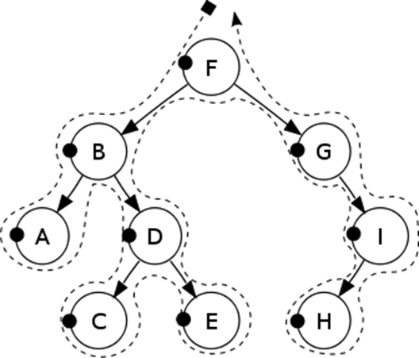
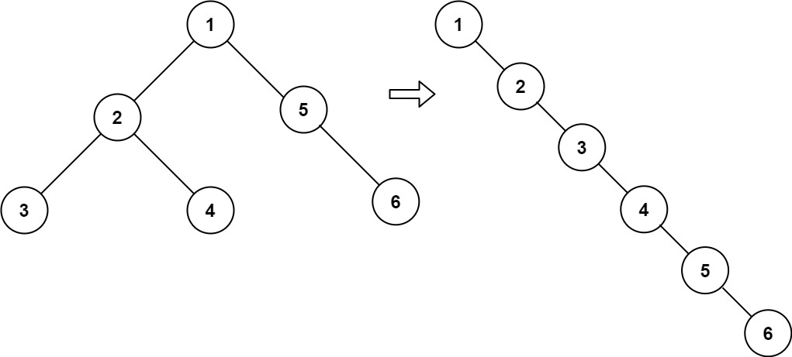
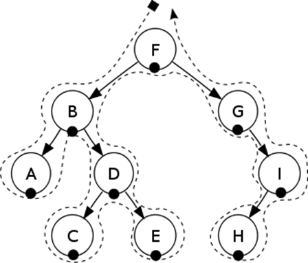
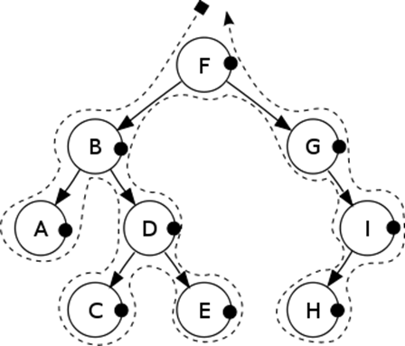

<!--more-->

二叉树是一个非常经典的数据结构了。对于任意一种数据结构，最重要的操作无非是**遍历**、**查找**、**插入**、**删除**，也就是**读**与**写**。由于二叉树的非线性结构，其遍历与查找有许多考究的地方。

我们先来研究它的四种基本遍历方式，pre-order、in-order、post-order、层序遍历。从本质上来说，前三者都属于深度优先遍历，而最后一种属于广度优先遍历。

## 1. 二叉树的遍历

从遍历顺序来看，二叉树的四种遍历并无难处:
* pre-order：中左右
* in-order: 左中右
* post-order：左右中
* 层序遍历：一层一层从上到下

如果让你使用迭代方式实现四种遍历的话，会发现细思极恐。我们先来探讨四种遍历。

### 1. 先序遍历

**Pre-Order先序遍历**，来自于[LeetCode144二叉树的先序遍历](https://leetcode-cn.com/problems/binary-tree-preorder-traversal/)。简单的先序遍历，居然有三种方法，没想到吧。一种一种来看。
1. 使用递归的版本：
    ```java
    class Solution {
        public List<Integer> preorderTraversal(TreeNode root) {
            List<Integer> res = new ArrayList<>();
            preorderAux(root, res);
            return res;
        }
        private void preorderAux(TreeNode root, List<Integer> res) {
            if (root != null) {
                res.add(root.val);
                preorderAux(root.left, res);
                preorderAux(root.right, res);
            }
        }
    }
    ```
2. 使用迭代的版本，其实也很简单，因为在递归版本中，隐式地维护了一个函数调用栈。因此，在迭代版本中需要我们显示地维护它。
   
    
    class Solution {
        public List<Integer> preorderTraversal(TreeNode root) {
            List<Integer> res = new ArrayList<>();
            Deque<TreeNode> stack = new LinkedList<>();
            while (!stack.isEmpty() || root != null) {
                // 一路向左
                while (root != null) {
                    res.add(root.val);
                    stack.push(root);
                    root = root.left;
                }
                // 左边整完了再整右边
                TreeNode node = stack.pop();
                root = node.right;
            }
            return res;
        }
    }
    
3. Mirror遍历。这种遍历是对迭代遍历的优化。旨在解决迭代遍历中Stack产生大量空间开销的问题。本质是使用中序遍历使得二叉树线索化。
    
    class Solution {
        public List<Integer> preorderTraversal(TreeNode root) {
            List<Integer> res = new ArrayList<Integer>();
            TreeNode predecessor = null;
            while (root != null) {
                if (root.left != null) {
                    // predecessor 节点就是当前 root 节点向左走一步，然后一直向右走至无法走为止
                    predecessor = root.left;
                    while (predecessor.right != null && predecessor.right != root) {
                        predecessor = predecessor.right;
                    }
                    // 让 predecessor 的右指针指向 root，继续遍历左子树
                    if (predecessor.right == null) {
                        res.add(root.val);
                        predecessor.right = root;
                        root = root.left;
                    }
                    // 说明左子树已经访问完了，我们需要断开链接
                    else {
                        predecessor.right = null;
                        root = root.right;
                    }
                }
                // 如果没有左孩子，则直接访问右孩子
                else {
                    res.add(root.val);
                    root = root.right;
                }
            }
            return res;
        }
    }
    

我们先来使用先序遍历解决一个简单的问题。这道题来自于[LeetCode617合并二叉树](https://leetcode-cn.com/problems/merge-two-binary-trees/)。给定两棵二叉树，将两棵二叉树对应的节点值相加，返回最终相加得到的二叉树。例如：
```
输入: 
	Tree 1                     Tree 2                  
          1                         2                             
         / \                       / \                            
        3   2                     1   3                        
       /                           \   \                      
      5                             4   7                  
输出: 
合并后的树:
	     3
	    / \
	   4   5
	  / \   \ 
	 5   4   7
```
仔细思考可以发现，这其实是一个递归的过程。先合并当前节点，再分别合并**左子树**和**右子树**。需要处理的是当前有节点为空的边界情况，只需要直接返回另一棵树的对应节点即可。

```java
class Solution {
    public TreeNode mergeTrees(TreeNode root1, TreeNode root2) {
        if (root1 == null || root2 == null) {
            return root1 == null ? root2 : root1;
        }
        root1.val += root2.val;
        root1.left = mergeTrees(root1.left, root2.left);
        root1.right = mergeTrees(root1.right, root2.right);
        return root1;
    }
}
```

为了深入理解先序遍历的内涵，我们自己观察先序遍历的遍历规律。我们发现，最先遍历到的一定是根节点，而最后遍历到的一定是最右边的节点。这个规律不仅对树本身有效，还对它的子树都有效。

```
          1
         / \
        2   3
       / \     
      4   5    
```

这么一来，我们的[LeetCode114二叉树展开为链表](https://leetcode-cn.com/problems/flatten-binary-tree-to-linked-list/)就有思路了。给定一棵二叉树，我们希望将其展开为链表。
* 链表是靠右指针连接的
* 所有节点的左指针必须置空
* 链表的遍历顺序必须是原来树的先序遍历顺序

考虑到先序遍历的顺序是中左右，那么右子树一定在遍历完左子树的最后一个节点后再遍历，那么我们需要将右子树接在左子树的最后一个节点的右侧。怎么样，是不是很有道理？

所以，这个算法是这样的：
1. 查找左子树的最右侧节点pre，将右子树接在pre的右侧。
2. 将左子树转移到右子树的位置，再将左子树置空。
3. 对右子树再循环上面两步



```java
class Solution {
    public void flatten(TreeNode root) {
        TreeNode cur = root;
        while (cur != null) {
            TreeNode pre = cur.left;
            if (pre != null) {
                while (pre.right != null) {
                    pre = pre.right;
                }
                pre.right = cur.right;
                cur.right = cur.left;
                cur.left = null;
            }
            cur = cur.right;
        }
    }
}
```

### 2. 中序遍历

这题来自于[LeetCode94二叉树的中序遍历](https://leetcode-cn.com/problems/binary-tree-inorder-traversal/)中序遍历同样有三种方式。

1. 递归方式。
    ```java
    class Solution {
        public List<Integer> inorderTraversal(TreeNode root) {
            List<Integer> res = new LinkedList<>();
            inorderAux(root, res);
            return res;
        }
        private void inorderAux(TreeNode root, List<Integer> res) {
            if (root != null) {
                inorderAux(root.left, res);
                res.add(root.val);
                inorderAux(root.right, res);
            }
        }
    }
    ```
2. 迭代方式。其实实现方法与先序遍历几乎一模一样，唯一的不同在于在第10行代码处才将当前节点加入到结果集中。原因是，中序遍历有个特点：**当第二次遍历到该节点时，才会访问该节点。**因此我们只访问从栈中返回的节点，因为栈中的节点都是已经经历过一遍了，从栈中弹出就是第二次经历了。
   
    
    class Solution {
        public List<Integer> inorderTraversal(TreeNode root) {
            List<Integer> res = new ArrayList<>();
            Deque<TreeNode> stack = new LinkedList<>();
            while (!stack.isEmpty() || root != null) {
                while (root != null) {
                    stack.push(root);
                    root = root.left;
                }
                TreeNode node = stack.pop();
                res.add(node.val);
                root = node.right;
            }
            return res;
        }
    }
    

3. Mirror中序遍历。与先序遍历也几乎完全一致，只是19行不同。你细品
   
    class Solution {
        public List<Integer> inorderTraversal(TreeNode root) {
            List<Integer> res = new ArrayList<Integer>();
            TreeNode predecessor = null;
            while (root != null) {
                if (root.left != null) {
                    // predecessor 节点就是当前 root 节点向左走一步，然后一直向右走至无法走为止
                    predecessor = root.left;
                    while (predecessor.right != null && predecessor.right != root) {
                        predecessor = predecessor.right;
                    }
                    // 让 predecessor 的右指针指向 root，继续遍历左子树
                    if (predecessor.right == null) {
                        predecessor.right = root;
                        root = root.left;
                    }
                    // 说明左子树已经访问完了，我们需要断开链接
                    else {
                        res.add(root.val);
                        predecessor.right = null;
                        root = root.right;
                    }
                }
                // 如果没有左孩子，则直接访问右孩子
                else {
                    res.add(root.val);
                    root = root.right;
                }
            }
            return res;
        }
    }
   


### 3. 后序遍历

这题来自于[LeetCode145二叉树的后续遍历](https://leetcode-cn.com/problems/binary-tree-postorder-traversal/)。后序遍历同样也有三种方式。

1. 递归方式。
   ```java
    class Solution {
        public List<Integer> postorderTraversal(TreeNode root) {
            List<Integer> res = new ArrayList<>();
            preorderAux(root, res);
            return res;
        }
        private void preorderAux(TreeNode root, List<Integer> res) {
            if (root != null) {
                preorderAux(root.left, res);
                preorderAux(root.right, res);
                res.add(root.val);
            }
        }
    }
   ```
2. 迭代方式。
   
   ```java
    class Solution {
        public List<Integer> postorderTraversal(TreeNode root) {
            List<Integer> res = new ArrayList<>();
            Deque<TreeNode> stack = new LinkedList<>();
            TreeNode prev = null;
            while (!stack.isEmpty() || root != null) {
                while (root != null) {
                    stack.push(root);
                    root = root.left;
                }
                root = stack.pop();
                if (root.right == null || root.right == prev) {
                    res.add(root.val);
                    prev = root;
                    root = null;
                }
                else {
                    // 如果有右节点，则二次将该节点加入栈
                    // 当第三次访问该节点时再加入结果集
                    stack.push(root);
                    root = root.right;
                }
            }
            return res;
        }
    }
   ```
3. Mirror后续遍历。太难了我不会呜呜呜，已经写了这么多了，现在已经快累爬了。直接贴LeetCode答案吧。
   ```java
    class Solution {
        public List<Integer> postorderTraversal(TreeNode root) {
            List<Integer> res = new ArrayList<Integer>();
            if (root == null) {
                return res;
            }

            TreeNode p1 = root, p2 = null;

            while (p1 != null) {
                p2 = p1.left;
                if (p2 != null) {
                    while (p2.right != null && p2.right != p1) {
                        p2 = p2.right;
                    }
                    if (p2.right == null) {
                        p2.right = p1;
                        p1 = p1.left;
                        continue;
                    } else {
                        p2.right = null;
                        addPath(res, p1.left);
                    }
                }
                p1 = p1.right;
            }
            addPath(res, root);
            return res;
        }

        public void addPath(List<Integer> res, TreeNode node) {
            int count = 0;
            while (node != null) {
                ++count;
                res.add(node.val);
                node = node.right;
            }
            int left = res.size() - count, right = res.size() - 1;
            while (left < right) {
                int temp = res.get(left);
                res.set(left, res.get(right));
                res.set(right, temp);
                left++;
                right--;
            }
        }
    }
   ```

### 4. 层序遍历

二叉树的层序遍历，也叫作广度 优先遍历。如果要实现层序遍历，则需要借助数据结构**队列**。不仅仅是二叉树的层序遍历如此，所有结构的层序遍历几乎都需要借助队列。

```java
    public void preOrder(TreeNode root) {
        if (root == null) {
            return;
        }
        // 使用一个队列保存当前层次的节点
        Deque<TreeNode> queue = new LinkedList<>();
        queue.add(root);
        while (!queue.isEmpty()) {
            // 记录当前层次的节点数，防止从队列中多拿元素
            int len = queue.size();
            while (len-- > 0) {
                TreeNode cur = queue.poll();
                System.out.println(cur.val);
                if (cur.left != null) {
                    queue.add(cur.left);
                }
                if (cur.right != null) {
                    queue.add(cur.right);
                }
            }
        }
    }
```

在[LeetCode102二叉树的层序遍历](https://leetcode-cn.com/problems/binary-tree-level-order-traversal/)中，我们解决的正是这么一个问题。这题这么写就不需要再另外赘述了，与上面两串代码几乎一模一样，无非是返回值不同罢了。

再来看一道层序遍历的例题，这道题来自于[LeetCode104二叉树的最大深度](https://leetcode-cn.com/problems/maximum-depth-of-binary-tree/)。给定一棵二叉树，函数的输入是二叉树的根节点，求解这棵二叉树的高度。

众所周知，二叉树的高度指的是二叉树最深的那条分支的长度，或者说二叉树最深的层次。所以，使用层序遍历，计算二叉树的层数即可。

```java
class Solution {
    public int maxDepth(TreeNode root) {
        if (root == null) {
            return 0;
        }
        Deque<TreeNode> queue = new LinkedList<>();
        queue.add(root);
        int res = 0;
        while (!queue.isEmpty()) {
            int len = queue.size();
            res ++;
            while (len-- > 0) {
                TreeNode cur = queue.poll();
                if (cur.left != null) {
                    queue.add(cur.left);
                }
                if (cur.right != null) {
                    queue.add(cur.right);
                }
            }
        }
        return res;
    }
}
```

这题实际上还有一种解法，我们放到后面再解释。

## 2. 基于遍历的算法

### 1. 与遍历顺序有关

#### 1. 常见的操作

首先来看一个对于二叉树来说比较常见的操作：[LeetCode98验证二叉搜索树](https://leetcode-cn.com/problems/validate-binary-search-tree/)。给定一棵树，判断这棵树是否为二叉搜索树。

> 至于什么是BST，笔者认为这个过于基础，如果不知道请查阅相关资料。

事实上，第一次接触这个问题的人，很容易犯错，他可能会认为。

```java
public boolean isValidBST(TreeNode root) {
    // 判断当前值是否小于左子节点的值，然后递归判断左子树
    if (root.left != null && (root.left.val >= root.val || !isValidBST(root.left))) {
        return false;
    }
    // 判断当前值是否大于右子节点的值，然后递归判断右子树
    if (root.right != null && (root.right.val <= root.val || !isValidBST(root.right))) {
        return false;
    }
    return true;
}
```

但是这样实际上是不对的。请读者仔细分析原因。正确的思路应该来自于**中序遍历**。中序遍历BST会得到有序的序列。事实上，我们不需要记录整个遍历序列，我们只需要记录遍历过程中的上一个数字就足够了，逐个进行比对即可。

```java
class Solution {
    // 用于记录上一个数字
    private long pre = Long.MIN_VALUE;
    public boolean isValidBST(TreeNode root) {
        return inOrder(root);
    }
    private boolean inOrder(TreeNode root) {
        if (root != null) {
            if (!inOrder(root.left) || pre >= root.val) {
                return false;
            }
            pre = root.val;
            return inOrder(root.right);
        }
        return true;
    }
}
```

这题实际上还有另一种解决方案，即我们采用先序遍历。在遍历时，由于我们会先访问根节点，而左子树的所有节点均要小于根节点，而右子树的所有节点均大于根节点。因此，虽然我们不能直接的得到BST的中序遍历，但我们却可以在逐渐的遍历中缩小每棵树当中节点的取值范围。这个算法需要写成先序遍历的递归形式。

```java
class Solution {
    public boolean isValidBST(TreeNode root) {
        return preOrder(root, Long.MIN_VALUE, Long.MAX_VALUE);
    }
    // 在先序遍历中传入子树的取值范围
    private boolean preOrder(TreeNode root, long minVal, long maxVal) {
        if (root == null) {
            return true;
        }
        if (root.val <= minVal || root.val >= maxVal) {
            return false;
        }
        // 子树的取值范围进一步缩小
        return preOrder(root.left, minVal, root.val) 
            && preOrder(root.right, root.val, maxVal);
    }
}
```

再把**二叉树最大深度**继续讲完，还有一种基于后序遍历的方法。为什么是后序遍历呢？因为后序遍历会先计算子树的高度，在计算父结点的高度。

```java
class Solution {
    public int maxDepth(TreeNode root) {
        if (root == null) {
            return 0;
        }
        return Math.max(maxDepth(root.left), maxDepth(root.right)) + 1;
    }
}
```

#### 2. 二叉树的对称与翻转

我们再来看几道与二叉树左右对称有关的题目。先来看[LeetCode101对称二叉树](https://leetcode-cn.com/problems/symmetric-tree/)。给定一个二叉树，检查它是否是左右对称二叉树。

可以说它并不是一种典型的二叉树遍历，说不上是前序中序后序层序哪一种。在对称二叉树中，任意一棵子树，都存在一棵与之对称的子树存在。我们只需要将对称的结点自顶向下两两比较即可。

```java
class Solution {
    public boolean isSymmetric(TreeNode root) {
        return root == null || check(root.left, root.right);
    }
    public boolean check(TreeNode leftTree, TreeNode rightTree) {
        if (leftTree == null && rightTree == null) {
            return true;
        }
        if (leftTree == null || rightTree == null) {
            return false;
        }
        // 左左树与右右树对称
        // 左右树与右左树对称
        return leftTree.val == rightTree.val 
            && check(leftTree.left, rightTree.right)
            && check(leftTree.right, rightTree.left);
    }
}
```

从上面的递归算法中，我们发现，在当前的递归层次中，我们就可以确定对称子树的配对关系。因此，我们可以参考层序遍历的思路，将其转化为迭代算法。

```java
class Solution {
    public boolean isSymmetric(TreeNode root) {
        if (root == null) {
            return true;
        }
        Deque<TreeNode> queue = new LinkedList<>();
        queue.offer(root.left);
        queue.offer(root.right);
        while (!queue.isEmpty()) {
            TreeNode leftTree = queue.poll();
            TreeNode rightTree = queue.poll();
            if (leftTree == null && rightTree == null) {
                continue;
            }
            if (leftTree == null || rightTree == null 
                    || leftTree.val != rightTree.val) {
                return false;
            }
            // 下面四条offer语句不能乱序
            // 左右对称子树要讲究门当户对
            queue.offer(leftTree.left);
            queue.offer(rightTree.right);
            queue.offer(leftTree.right);
            queue.offer(rightTree.left);
        }
        return true;
    }
}
```

看完二叉树的对称，再来看[LeetCode226翻转二叉树](https://leetcode-cn.com/problems/invert-binary-tree/)。对于一棵二叉树，我们希望得到其左右翻转后的二叉树。

这道题倒是没什么难度，主要是它有个梗。有个程序员Max Howell面试谷歌。

> 谷歌：我们90％的工程师使用您编写的软件(Homebrew)，但是您却无法在面试时在白板上写出翻转二叉树这道题，这太糟糕了。

笔者为了节约篇幅，在此处只展示了迭代算法。如果你会了这题，是不是在某种程度上已经超过了Max Howell。😂

```java
class Solution {
    public TreeNode invertTree(TreeNode root) {
        if (root == null) {
            return null;
        }
        Deque<TreeNode> queue = new LinkedList<>();
        queue.offer(root);
        while (!queue.isEmpty()) {
            TreeNode node = queue.poll();
            // 交换左右子树
            TreeNode tmpNode = node.left;
            node.left = node.right;
            node.right = tmpNode;
            // 再将左右子树放入队列，进行对它们也进行翻转
            if (node.left != null) {
                queue.offer(node.left);
            }
            if (node.right != null) {
                queue.offer(node.right);
            }
        }
        return root;
    }
}
```
#### 3. 不常见的操作

这道题来自于[LeetCode543二叉树的直径](https://leetcode-cn.com/problems/diameter-of-binary-tree/submissions/)。二叉树的直径是指**在二叉树中最长的一段路径**。这条路径未必要经过根节点，但是一定要是最长的。请范围二叉树的直径长度。

像高度啊，长度啊，这类题目，我们最先想到的就是使用后序遍历。因此，在后序遍历中，我们分别计算左右子树的高度，就可以计算经过当前节点的最长路径。我们只需要依次计算经过每个结点的最长路径，用max函数计算它们之间的最大值即可。

```java
class Solution {
    private int ans = 0;
    public int diameterOfBinaryTree(TreeNode root) {
        postOrder(root);
        return ans;
    }
    private int postOrder(TreeNode root) {
        if (root == null) {
            return 0;
        }
        int leftHeight = postOrder(root.left);
        int rightHeight = postOrder(root.right);
        ans = Math.max(leftHeight + rightHeight, ans);
        return Math.max(leftHeight, rightHeight) + 1;
    }
}
```

然后再来看一道非常规的遍历。这道题来自于[LeetCode538把BST转换为累加树](https://leetcode-cn.com/problems/convert-bst-to-greater-tree/)。我们需要计算一棵BST中每个大于当前节点的所有节点的和。下面这张图很形象的体现了这一点。


如果要从小到大求和，那么用中序遍历即可。然而此题是从大到小求和，因此是**反中序遍历**。知道了思路后，题目就显得尤为简单了。

```java
class Solution {
    private int sum = 0;
    public TreeNode convertBST(TreeNode root) {
        revInOrder(root);
        return root;
    }
    private void revInOrder(TreeNode root) {
        if (root != null) {
            revInOrder(root.right); // 右
            sum += root.val; // 中
            root.val = sum;
            revInOrder(root.left); // 左
        }
    }
}
```

下面再来看一题（当然你也可以休息一下🌈）。这道题来自于[LeetCode236二叉树的最近公共祖先](https://leetcode-cn.com/problems/lowest-common-ancestor-of-a-binary-tree/)。题意很清晰，给定一棵二叉树以及二叉树当中的两个节点，寻找这两个节点在该二叉树当中的最近公共祖先。因为我们要找的是“最近”的公共祖先，因此完全可以采用后序遍历这类自底向上算法。

```java
class Solution {
    private TreeNode res;
    public TreeNode lowestCommonAncestor(TreeNode root, TreeNode p, TreeNode q) {
        postOrder(root, p, q);
        return res;
    }
    private boolean postOrder(TreeNode root, TreeNode p, TreeNode q) {
        if (root == null) {
            return false;
        }
        // 检查左子树是否出现目标节点
        boolean leftRes = postOrder(root.left, p, q);
        // 检查右子树是否出现目标节点
        boolean rightRes = postOrder(root.right, p, q);
        // 检查当前层次是否出现目标节点
        boolean curRes = root.val == p.val || root.val == q.val;
        int count = (leftRes ? 1 : 0) + (rightRes ? 1 : 0) + ( curRes ? 1 : 0);
        // 计数等于2，则说明当前节点是最近公共祖先
        if (count == 2) {
            res = root;
        }
        // 有一个条件成立则说明当前子树出现了目标节点
        return count > 0;
    }
}
```

#### 4. 用遍历序列还原二叉树

这道题来自于[LeetCode105从前序与中序遍历序列构造二叉树](https://leetcode-cn.com/problems/construct-binary-tree-from-preorder-and-inorder-traversal/)。给定前序遍历得到的数组与中序遍历得到的数组，用这两个数组还原出原来的二叉树。

我们知道，前序遍历+中序遍历可以唯一确定一棵树，中序遍历+后序遍历也可以唯一确定一棵树。因此这道题所说的树是唯一确定的。

在前序遍历中，根节点始终在子节点的前面。在中序遍历中，左节点在根节点之前，而右节点在根节点之后。因此，我们可以用前序遍历寻找根节点，然后再用中序遍历计算左子树的长度与右子树的长度，因为左子树与右子树以根节点为界分成两段嘛。我们先来看如何用递归方式构造树。

```java
class Solution {
    private Map<Integer, Integer> map;
    private int[] preorder;
    private int[] inorder;
    public TreeNode buildTree(int[] preorder, int[] inorder) {
        this.preorder = preorder;
        this.inorder = inorder;
        // map反向记录中序数组，便于后续查询根节点的下标
        map = new HashMap<>();
        for (int i = 0 ; i < inorder.length ; i ++) {
            map.put(inorder[i], i);
        }        
        return buildTreeAux(0, preorder.length - 1, 0, inorder.length - 1);
    }
    private TreeNode buildTreeAux(int preorderLeft, int preorderRight, int inorderLeft, int inorderRight) {
        if (preorderLeft > preorderRight) {
            return null;
        }
        // 前序遍历第一个结点即是根节点
        TreeNode root = new TreeNode(preorder[preorderLeft]);
        // 根节点在中序遍历中的位置
        int rootIdx = map.get(preorder[preorderLeft]);
        // 计算左子树长度，因为左右子树以根节点为界
        int leftLength = rootIdx - inorderLeft;
        // 计算右子树长度
        int rightLength = inorderRight - rootIdx;
        // 构造左子树，关注两个数组的区间变化
        root.left = buildTreeAux(preorderLeft + 1, preorderLeft + leftLength, inorderLeft, rootIdx - 1);
        // 构造右子树
        root.right = buildTreeAux(preorderLeft + leftLength + 1, preorderRight, rootIdx + 1, inorderRight);
        // 根节点构造完毕，可以返回了
        return root;
    }
}
```

再来看基于迭代的实现。基于迭代的方法看起来似乎有一点点晦涩，但实际上还好吧。

```java
class Solution {
    public TreeNode buildTree(int[] preorder, int[] inorder) {
        Deque<TreeNode> stack = new LinkedList<>();
        int inorderIndex = 0;
        TreeNode root = new TreeNode(preorder[0]);
        stack.push(root);
        // 由于使用了前序遍历的数组作为构建的主数组
        // 这是一个类似前序遍历的过程
        for (int i = 1 ; i < preorder.length ; i ++) {
            int preorderVal = preorder[i];
            TreeNode parent = stack.peek();
            // 请仔细考虑下一句话：
            // 如果当前if条件成立，则说明左子树已经遍历完成，preorder不属于栈顶节点的左子树
            // 如果不成立，则当前preorderVal属于栈顶节点的左子树
            // 原因是：当遍历到中序的元素时，说明已经到达左子树最深的地方
            if (inorder[inorderIndex] != parent.val) {
                parent.left = new TreeNode(preorderVal);
                stack.push(parent.left);
            } else {
                // 寻找preorderVal到底是谁的右子树
                // 如果stack.peek().val == inorder[inorderIndex]
                // 则说明当前node没有右子树
                while (!stack.isEmpty() && stack.peek().val == inorder[inorderIndex]) {
                    parent = stack.pop();
                    inorderIndex ++;
                }
                parent.right = new TreeNode(preorderVal);
                stack.push(parent.right);
            }
        }
        return root;
    }
}
```

### 2. 与遍历顺序无关

#### 1. 二叉树的序列化与反序列化

这道题来自于[LeetCode297二叉树的序列化与反序列化](https://leetcode-cn.com/problems/serialize-and-deserialize-binary-tree/)。题目被LeetCode官方标记为Difficult，是在是名不副实了，毕竟上一题都只有Medium，但我觉得上一题是比这题难的。

这题要求我们设计二叉树的序列化与反序列化算法。第一次做可能会没有头绪。但是从上一题过来的人，肯定会想到，用前序+中序、中序+后序，都可以还原一个二叉树。

我们这次换一个角度想想看，能不能使用一个遍历序列就还原出二叉树呢？答案是可以的。我们平时使用前序遍历还原二叉树，所遇到的困难，无非就是因为不知道什么时候子树已经被遍历完了。而实际上，我们可以在叶子节点后标记一个null，来表示子树已经到达叶子了。为了节省空间，我们可以用单独一个字母n来取代null。如下所示：

```
1,2,n,n,3,4,n,n,5,n,n,
```

```java
public class Codec {

    // Encodes a tree to a single string.
    public String serialize(TreeNode root) {
        StringBuilder sb = new StringBuilder();
        serializeAux(root, sb);
        return sb.toString();
    }
    private void serializeAux(TreeNode root, StringBuilder sb) {
        if (root == null) {
            sb.append('n').append(',');
            return;
        }
        // pre order
        sb.append(root.val).append(',');
        serializeAux(root.left, sb);
        serializeAux(root.right, sb);
    }

    // Decodes your encoded data to tree.
    public TreeNode deserialize(String data) {
        List<String> values = new LinkedList<>(Arrays.asList(data.split(",")));
        return deserializeAux(values);
    }
    private TreeNode deserializeAux(List<String> values) {
        String value = values.remove(0);
        if (value.equals("n")) {
            return null;
        }
        // pre order
        TreeNode root = new TreeNode(Integer.valueOf(value));
        root.left = deserializeAux(values);
        root.right = deserializeAux(values);
        return root;
    }
}
```

你也看到了，笔者在算法中使用了前序遍历。实际上，任何一种遍历方式都是可以的。但无论用哪一种方式遍历，序列化与反序列化算法应当约定好一致，这就是所谓的**协议**。

#### 2. 前缀树

严格的说，这题并不是一题二叉树的题目，更像是一棵普通的26叉树。放在这里就当是长长见识，拓宽眼界。

这道题来自于[LeetCode208实现前缀树](https://leetcode-cn.com/problems/implement-trie-prefix-tree/)。题目不难，我们要构造一棵26叉树。
* 存在的节点则实例化，不存在的节点则不实例化，让它保持为null。
* 树的节点需要有一个isTerminal变量作为标记，表示是否存在单词以当前节点为结尾的。

```java
class Trie {
    class TreeNode {
        TreeNode[] next;
        // 是否存在以当前节点为结尾的单词
        boolean isTerminal;
        TreeNode() {
            next = new TreeNode[26];
            isTerminal = false;
        }
    }
    private TreeNode root;
    public Trie() {
        this.root = new TreeNode();
        this.root.isTerminal = true;
    }
    
    public void insert(String word) {
        TreeNode node = root;
        for (char c : word.toCharArray()) {
            int index = c - 'a';
            if (node.next[index] == null) {
                node.next[index] = new TreeNode();
            }
            node = node.next[index];
        }
        node.isTerminal = true;
    }
    
    public boolean search(String word) {
        TreeNode node = root;
        for (char c : word.toCharArray()) {
            int index = c - 'a';
            if (node.next[index] == null) {
                return false;
            }
            node = node.next[index];
        }
        // 还要判断是否存在以该节点为结尾的单词
        return node.isTerminal;
    }
    
    public boolean startsWith(String prefix) {
        TreeNode node = root;
        for (char c : prefix.toCharArray()) {
            int index = c - 'a';
            if (node.next[index] == null) {
                return false;
            }
            node = node.next[index];
        }
        // 与search唯一不同的就是最后一行，直接返回true
        return true;
    }
}
```

## 3. 方法总结

* 前序遍历的根节点先访问，属于自顶向下方法。

* 中序遍历的遍历顺序对于BST来说刚好是升序排列。

* 后续遍历属于自底向上方法，当父节点的求解依赖于子节点时，可以考虑使用。例如求高度、直径之类的。

* 层序遍历逐层访问。区别于上面三种算法，是一种广度优先遍历。

> 声明：文中关于二叉树遍历的三张图片来源于笔者本科阶段老师邹广宇的PPT，本人在网上实在是没找到它们的出处。