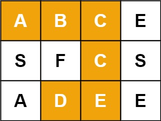

DFS即深度优先搜索，来自于图论，有时也运用于Web爬虫充当爬取策略。

<!--more-->

本质上，DFS属于遍历算法，即至少对需要操作的数据结构进行一次遍历。因此时间复杂度的上限为$O(n^2)$。与树的遍历类似，我们可以使用递归或者迭代实现DFS。如果使用迭代的话，需要借助Stack数据结构模拟函数调用栈。

我们先来介绍DFS在排列组合中的运用。

## 1. 排列与组合

在数学中的排列组合往往是计算排列或组合的数量。而在算法中，我们更加关注于如何将排列或组合的结果用一个集合展现出来。

先来看几道排列问题。

### 1. 排列

这道题来自于[LeetCode22.括号生成](https://leetcode-cn.com/problems/generate-parentheses/)。给定一个数字n，代表要生成n对括号。请输出n对括号的有效排列。

何为有效排列？先来几个直观的例子：

```
Valid: (())
Invalid: (() 
```

一个很直观的感受就是，在无效的括号排列中，左右括号的数量是不一样的。然而，只要保证左右侧括号的数量一致，就一定是有效的括号排列吗？不一定，看如下例子:

```
Invalid: ())(()
```

这显然也不是一组有效的括号。错误的原因在于，当我们从左往右数，会发现，当数到第3个括号时，右侧括号的数量多于左侧括号数量，也就是说，多余出来的右括号找不到与之匹配的左括号。

因此，我们在从左往右生成括号时，在每个阶段，都要保证右括号的数量不超过左括号的数量。

这也就是本题DFS递归的终止条件之一。另一个终止条件是左括号数量不超过n，这是题目的要求。

1. 当左括号数量少于n时，可以继续添加左括号
2. 当左括号数量多于n时，可以继续添加右括号
3. `左括号数量 = 右括号数量 = n`时，递归终止

```java
class Solution {
    public List<String> generateParenthesis(int n) {
        List<String> res = new LinkedList<>();
        dfs(n, 0, 0, new StringBuilder(), res);
        return res;
    }
    private void dfs(int n, int leftNum, int rightNum, StringBuilder sb,List<String> res) {
        // 递归终止，剪枝回溯
        if (leftNum == n && rightNum == n) {
            res.add(sb.toString());
            return;
        }
        // 追加左括号
        if (leftNum < n) {
            sb.append('(');
            dfs(n, leftNum + 1, rightNum, sb, res);
            sb.deleteCharAt(sb.length()-1);
        }
        // 追加右括号
        if (leftNum > rightNum) {
            sb.append(')');
            dfs(n, leftNum, rightNum + 1, sb, res);
            sb.deleteCharAt(sb.length()-1);
        }
    }
}
```

在括号排列中，我们可以排列的元素只有两种：左括号与右括号。更一般的，我们允许排列的元素种类应该是任意个。来看下一题。

这道题来自于[LeetCode46.全排列](https://leetcode-cn.com/problems/permutations/)。题目意思很简单也很经典，给定一个不包含重复数字的数组nums，输出这个数组元素的全排列。

例如：
```
输入：nums = [1,2,3]
输出：[[1,2,3],[1,3,2],[2,1,3],[2,3,1],[3,1,2],[3,2,1]]
```

简单点，依然是采用递归实现DFS的思路。唯一与上题不同的是，由于排列的元素数量任意，使用循环更加合理。

```java
class Solution {
    public List<List<Integer>> permute(int[] nums) {
        List<List<Integer>> res = new LinkedList<>();
        List<Integer> numsList =  new LinkedList<>();
        for (int num : nums) {
            numsList.add(num);
        }
        dfs(numsList, new LinkedList<>(), res);
        return res;
    }
    private void dfs(List<Integer> nums, List<Integer> list, List<List<Integer>> res) {
        if (nums.isEmpty()) {
            res.add(new ArrayList<>(list));
            return;
        }
        for (int i = 0 ; i < nums.size() ; i ++) {
            list.add(nums.remove(i));
            dfs(nums, list, res);
            nums.add(i, list.remove(list.size() - 1));
        }
    }
}
```

### 2. 组合

在排列中，我们强调元素的出现顺序，而组合不强调顺序。

先来看第一个经典的组合。这道题来自于[LeetCode78.子集](https://leetcode-cn.com/problems/subsets/)。给定一个数组，要求输出所有子集。由于集合是无序的，因此本质上是求数组中元素的组合。

与上一题排列十分类似，唯一不同的就是要求输出的是组合。例如：

```
输入：nums = [1,2,3]
输出：[[],[1],[2],[1,2],[3],[1,3],[2,3],[1,2,3]]
```

对于数组中任意一个元素，只有两种可能性：保留或者不保留。由这两种可能性产生的递归树是一棵二叉树。谈到这里，代码应该也就大致明白怎么写了。

```java
class Solution {
    public List<List<Integer>> subsets(int[] nums) {
        List<List<Integer>> res = new LinkedList<>();
        dfs(nums, 0, new LinkedList<>(), res);
        return res;
    }
    private void dfs(int[] nums, int index, List<Integer> list, List<List<Integer>> res) {
        if (index == nums.length) {
            res.add(new ArrayList<>(list));
            return;
        }
        // 不保留
        dfs(nums, index + 1, list, res);
        list.add(nums[index]);
        // 保留
        dfs(nums, index + 1, list, res);
        // 添加完记得从list中删除哦
        list.remove(list.size() - 1);
    }
}
```

在上一个问题中，我们的所有元素都只有保留或者不保留两种可能性。更一般的，我们的所有元素应该具有更多的状态（似曾相识燕归来）。下面来看[LeetCode17.电话号码的字母组合](https://leetcode-cn.com/problems/letter-combinations-of-a-phone-number/)。

在老式的案件手机或者只能手机的九键输入法中，数字2至9均代表了不同的字母，如下图所示。


输入一串数字，每个数字均在\[2,9\]的范围内。输出这串数字所能代表的所有可能的字母组合。例如，
```
输入：digits = "23"
输出：["ad","ae","af","bd","be","bf","cd","ce","cf"]
```
只是每个数字所产生的可能性变多了而已，在上一题的基础上使用一个循环就能解决问题。


```java
class Solution {
    private static final String[] map = {
        "abc", "def", "ghi", "jkl", "mno", "pqrs", "tuv", "wxyz"
    };
    public List<String> letterCombinations(String digits) {
        List<String> res = new LinkedList<>();
        if (digits != null && !digits.equals("")) {
            dfs(digits, 0, new StringBuilder(), res);
        }
        return res;
    }
    private void dfs(String digits, int index, StringBuilder sb, List<String> res) {
        if (index == digits.length()) {
            res.add(sb.toString());
            return;
        }
        String values = map[digits.charAt(index) - '2'];
        // 多种可能性，使用循环代替
        for (int i = 0 ; i < values.length() ; i ++) {
            sb.append(values.charAt(i));
            dfs(digits, index + 1, sb, res);
            sb.deleteCharAt(sb.length() - 1);
        }
    }
}
```

上面提到的所有题目中，递归的终止条件都是抵达数组的终点，而且抵达终点后，只需要将list加入结果集中集合。这次玩点花的，递归的终点是一个范围，而且终点值不同，操作方法也不同。

来看[LeetCode39.组合总和](https://leetcode-cn.com/problems/combination-sum/)。给定一个无重复元素的数组和一个目标整数。在数组中选出一些数字，使得数字之和是目标数字，返回被选出的数字。数组中的元素可以被选中任意次。下面是一个例子：

```
输入：candidates = [2,3,6,7], target = 7
输出：[[2,2,3],[7]]
解释：
2 和 3 可以形成一组候选，2 + 2 + 3 = 7 。注意 2 可以使用多次。
7 也是一个候选， 7 = 7 。
仅有这两种组合。
```

关于这个问题，我最快想到的是一个与之类似的经典题目——整钱换零钱，有几种换法。题目是完全一样的。递归的思路与上一题也一致，就是个带循环的递归。唯一不同的是终止条件，当结果为target时，将选中的数字放入结果集中，否则直接return。

```java
class Solution {
    public List<List<Integer>> combinationSum(int[] candidates, int target) {
        List<List<Integer>> res = new LinkedList<>();
        dfs(candidates, 0, 0, target, new LinkedList<>(), res);
        return res;
    }
    private void dfs(int[] candidates, 
                     int index, 
                     int sum, 
                     int target, 
                     List<Integer> list, 
                     List<List<Integer>>res) {
        if (sum == target) {
            res.add(new ArrayList<>(list));
        }
        if (sum >= target || index == candidates.length) {
            return;
        }
        // 从父调用栈的index处开始循环
        for (int i = index ; i < candidates.length ; i ++) {
            list.add(candidates[i]);
            dfs(candidates, i, sum + candidates[i], target, list, res);
            list.remove(list.size()-1);
        }
    }
}
```

Wait a minute，这种解法还有一个小小的优化技巧。如果，我们将数组按照从小到大排序，那么就会优先选取较小的数字。如果sum加上较小的数字都会导致超出target，那么后面的循环就没有必要进行了，这就是小小的回溯剪枝。做了这种优化后，在LeetCode上获得了`4ms -> 2ms`的提升。
```java
class Solution {
    public List<List<Integer>> combinationSum(int[] candidates, int target) {
        List<List<Integer>> res = new LinkedList<>();
        Arrays.sort(candidates); // 排序
        dfs(candidates, 0, 0, target, new LinkedList<>(), res);
        return res;
    }
    private void dfs(int[] candidates, 
                     int index, 
                     int sum, 
                     int target, 
                     List<Integer> list, 
                     List<List<Integer>>res) {
        if (sum == target) {
            res.add(new ArrayList<>(list));
        }
        if (sum >= target || index == candidates.length) {
            return;
        }
        for (int i = index ; i < candidates.length ; i ++) {
            if (sum + candidates[i] > target) {
                break; // 回溯剪枝
            }
            list.add(candidates[i]);
            dfs(candidates, i, sum + candidates[i], target, list, res);
            list.remove(list.size()-1);
        }
    }
}
```

## 2. 二维DFS

排列与组合问题都属于一维DFS。实际上还有多维DFS，难度并没有增加，只是多了几个递归方向罢了。

### 1. 单词搜索

这道题来自于[LeetCode79.单词搜索](https://leetcode-cn.com/problems/climbing-stairs/)。给定一个二维矩阵，矩阵中的每个位置都是一个字母。请在矩阵中找出指定单词word，字母所在的格子必须是相邻的（不能是斜对角的）。格子不能重复经过。可以找到返回true，否则返回false。

例如，在下图中寻找单词`"ABCCED"`，应该返回true。



```
输入：board = [["A","B","C","E"],["S","F","C","S"],["A","D","E","E"]], word = "ABCCED"
输出：true
```

这题真没什么难的对吧。我们用一个循环，假设每个元素位置为起点，向四周搜索即可。唯一值得注意的就是，当前字母已经被使用过时，需要用`'\0'`标记矩阵的位置，待递归完成后再还原之。

```java
class Solution {
    public boolean exist(char[][] board, String word) {
        for (int i = 0 ; i < board.length ; i ++) {
            for (int j = 0 ; j < board[0].length ; j ++) {
                // 为了避免创建不必要调用栈带来的开销，首字母不相等就不需要进入dfs函数
                if (board[i][j] == word.charAt(0) && dfs(board, i, j, word, 0)) {
                    return true;
                }
            }
        }   
        return false;
    }
    private boolean dfs(char[][] board, int i, int j, String word, int index) {
        if (index == word.length()) {
            return true;
        }
        // 在这里，我经过“反复测试”，发现大于等于号(>=)居然比等号(==)快一点点
        if (i < 0 || j < 0 
            || i >= board.length || j >= board[0].length 
            || board[i][j] != word.charAt(index)) {
            return false;
        }
        char c = board[i][j];
        // 将元素标记，防止重复搜索
        board[i][j] = '\0';
        if (dfs(board, i + 1, j, word, index + 1) 
          ||dfs(board, i - 1, j, word, index + 1)
          ||dfs(board, i, j + 1, word, index + 1)
          ||dfs(board, i, j - 1, word, index + 1)) {
            // 矩阵还原，下同
            board[i][j] = c;
            return true;
          }
        board[i][j] = c;
        return false;
    }
}
```

### 2. 岛屿数量

这道题来自于[LeetCode200.岛屿数量](https://leetcode-cn.com/problems/number-of-islands/)。给定一个二维矩阵，其中只有0和1。假设0是水面，1是陆地，求岛屿数量。例如：

```
输入：grid = [
  ["1","1","1","1","0"],
  ["1","1","0","1","0"],
  ["1","1","0","0","0"],
  ["0","0","0","0","0"]
]
输出：1
```
所谓岛屿，即连续的陆地，只要四面环水，没有水平或者竖直方向上的陆地相连，则两个岛屿是孤立的。

依然是采用DFS策略，并且与上题更加类似的是，我们需要将遍历过的陆地用2标记，最后再将标记2的位置还原为1。

```java
class Solution {
    public int numIslands(char[][] grid) {
        int res = 0;
        for (int i = 0 ; i < grid.length ; i ++) {
            for (int j = 0 ; j < grid[0].length ; j ++) {
                if (grid[i][j] == '1') {
                    res ++;
                    // dfs的方式填充整片岛屿
                    fill(grid, i, j);
                }
            }
        }
        // 此处应该要将矩阵中的2还原为1，很简单，不展示代码了
        return res;
    }
    private void fill(char[][] grid, int i, int j) {
        // 超出边界、遇到已填充陆地、遇到水域，都会导致该方向的填充终止
        if (i < 0 || j < 0 || i >= grid.length || j >= grid[0].length 
         || grid[i][j] != '1') {
            return;
        }
        grid[i][j] = '2';
        fill(grid, i + 1, j);
        fill(grid, i - 1, j);
        fill(grid, i, j + 1);
        fill(grid, i, j - 1);
    }
}
```

使用DFS会存在一个弊端，如果我们的测试用例中出现特别多的陆地，比如说全部都是陆地，那么算法的空间复杂度会来到惊人的$O(MN)$，可能会导致`Stack Overflow Error`。为了避免这种事情发生，使用BFS可能是一个更好的策略。在BFS中，我们使用一个FIFO队列来存放陆地的坐标。每格陆地发散式的向周围扩散查找，在最坏情况下，队列的规模会达到$O(max(M,N))$，而且存放于堆内存中，不容易产生内存溢出。

```java
class Solution {
    public int numIslands(char[][] grid) {
        int res = 0;
        for (int i = 0 ; i < grid.length ; i ++) {
            for (int j = 0 ; j < grid[0].length ; j ++) {
                if (grid[i][j] == '1') {
                    res ++;
                    Deque<Integer> queue = new LinkedList<>();
                    // 低16位存储i，高16位存储j，这令人窒息的操作
                    // 也不知道是我哪根筋抽了想了这么个操作
                    // 如果不习惯的话，可以改成Deque<int[]>
                    // 在Java中，基本类型的数组是类，在Golang中甚至可以用int[2]
                    queue.add(i + (j << 16));
                    while (!queue.isEmpty()) {
                        int index = queue.poll();
                        // 解码成普通的i、j
                        int indexJ = index >> 16;
                        int indexI = index - (indexJ << 16);
                        if (0 <= indexI && indexI < grid.length
                         && 0 <= indexJ && indexJ < grid[0].length
                         && grid[indexI][indexJ] == '1') {
                             grid[indexI][indexJ] = '2';
                             // 将i、j编码成一个int
                             // 不管当前坐标是否越界、是否不是水域、是否已经遍历过
                             // 先丢到队列里面再说
                             queue.add(indexI + 1 + (indexJ  << 16));
                             queue.add(indexI - 1 + (indexJ  << 16));
                             queue.add(indexI + ((indexJ + 1)  << 16));
                             queue.add(indexI + ((indexJ - 1)  << 16));
                        }
                    }
                }
            }
        }
        return res;
    }
}
```