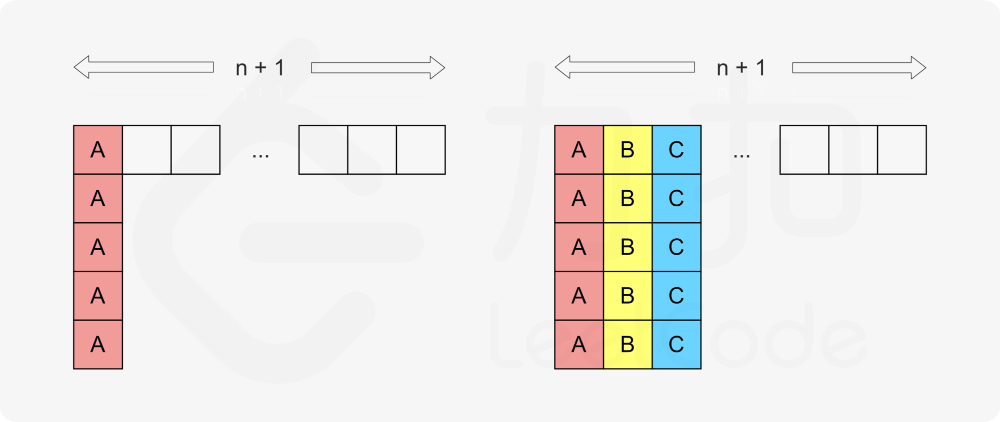
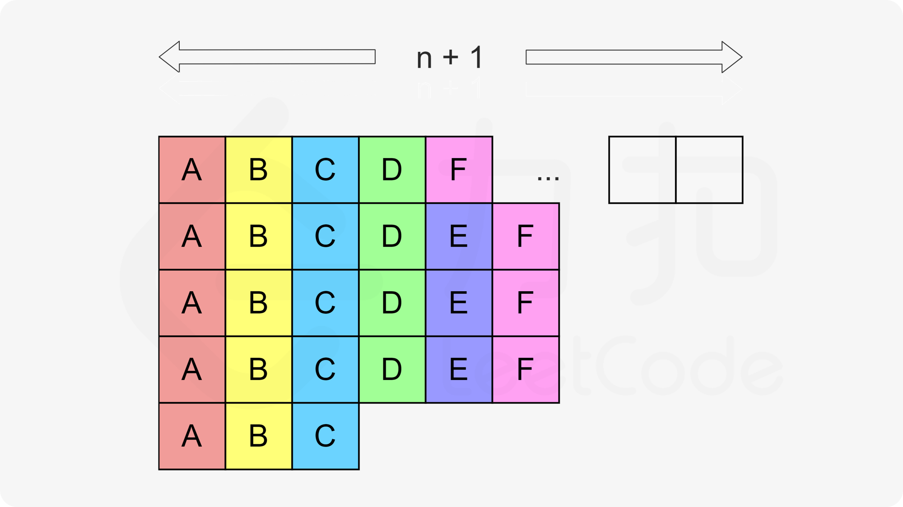
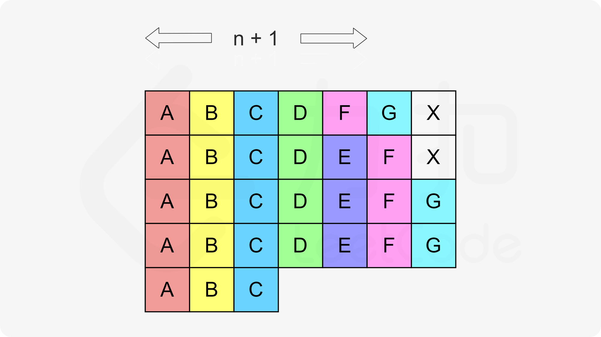
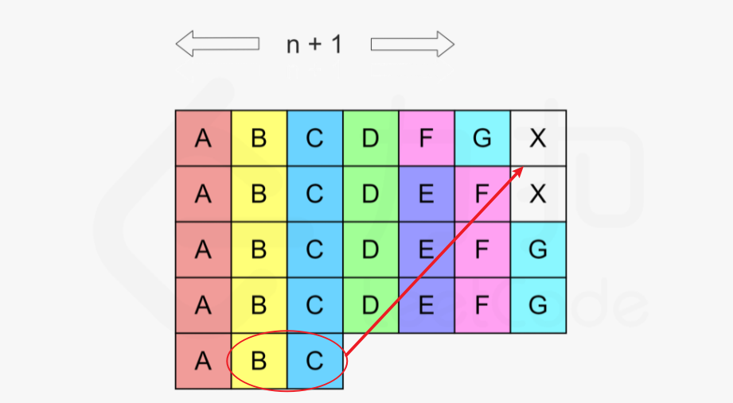

贪心算法不仅仅是一种算法，更是一种思想，运用于生活的方方面面。

<!--more-->

关于贪心法的例题并不多，此处我们只举例三个例题。

## 1. 跳跃游戏

这道题来自于[LeetCode55跳跃游戏](https://leetcode-cn.com/problems/jump-game/)。给定一个非负数组，从数组的第0个位置开始出发，数组元素的值代表能前进的步数。设计算法来计算能否到达数组结尾。

例如，数组`nums = [2,3,1,1,4]`，我们可以`0->1->4`到达结尾。因此返回true。

事实上，这道题是很容易想到贪心的思路的，因为往往跳到最远的位置，即是最优的。然而，如果每次都跳到当前位置能抵达的最远位置，在如下数组中会返回错误结论。

```
nums = [2, 3, 0, 1, 1]
```
使用上面所说的策略，我们第一次就会跳到元素值为0的位置，便不能再前进。而实际上，用我们聪明的脑子，很容易就能想到，第一次我们只前进1格，第二次前进3格，便能抵达终点。

因此，我们算法关注的是**在该格子以前的所有格子能到达的最远目标**，而不只是**当前格子能达到的最远目标**，are you懂？因此，我们只需从左到右遍历数组，记录目前为止左侧格子能抵达的最远的右侧格子。当遍历不能继续前进时，返回false，若能抵达的最远右侧格子已经`>=`数组长度，那么返回true。

```java
class Solution {
    public boolean canJump(int[] nums) {
        int rightRange = 0;
        // 两个退出循环的条件
        // 第一个条件：i防止超出能够抵达的右边界
        // 第二个条件：如果已经能到终点了，则肯定是true，后边的元素不需要访问了
        for (int i = 0 ; i <= rightRange && rightRange < nums.length - 1; i ++) {
            rightRange = Math.max(rightRange, i + nums[i]);
        }            
        return rightRange >= nums.length - 1;
    }
}
```

## 2. 合并区间

这道题来自[LeetCode56.合并区间](https://leetcode-cn.com/problems/merge-intervals/)。作为跳跃游戏的下一题，这两道题有着异曲同工之妙，下面听我扯一扯。

给定一个n*2维的数组，代表n个区间。我们需要将其中交叉或者重叠的区间合并。最终返回不能再合并的m个区间。

例如，`intervals = [[1,3],[2,6],[7,9],[9,11],[10,15]]`，它们可以被合并为`[[1,6],[7,15]]`。

从上面给出的例子也能看出来，如果将区间按照左端进行排序，那么问题会简单一些。紧接着，我们发现，只要从左往右遍历，我们维护一个当前能触及的最远右边界rightRange，如果当前区间的左边界超过了rightRange，那么该区间不能被上一个区间所合并，反之则可以合并。

怎么说，我没骗你吧，是不是和上一题的贪心策略几乎一模一样？😋

```java
class Solution {
    public int[][] merge(int[][] intervals) {
        if (intervals == null) {
            return null;
        }
        // 按左侧排序区间
        Arrays.sort(intervals, Comparator.comparingInt(i -> i[0]));
        List<int[]> list = new LinkedList<>();
        // 记录当前合并区间的左右边界
        int leftRange = intervals[0][0];
        int rightRange = intervals[0][1];
        
        for (int i = 1 ; i < intervals.length ; i ++) {
            if (intervals[i][0] <= rightRange) {
                // 扩充到上一个区间
                rightRange = Math.max(rightRange, intervals[i][1]);
            } else {
                // 与当前区间已无交集
                list.add(new int[] {leftRange, rightRange});
                leftRange = intervals[i][0];
                rightRange = intervals[i][1];
            }
        }
        list.add(new int[] {leftRange, rightRange});
        return list.toArray(new int[list.size()][2]);
    }
}
```

## 3. 任务调度器

这道题来自于[LeetCode621.任务调度器](https://leetcode-cn.com/problems/task-scheduler/)。这实际上是一个运筹学问题，此处我们用算法解决。

给定一组任务，每个任务的执行之间均为一个单位时间。我们规定，两个相同的任务之间要有n个冷却单位时间，在这冷却时间内，可以执行别的任务，或者啥都不干。请问至少需要多少时间才能执行完所有任务。

例如，给定任务`task = ['A, 'A', 'B', 'B']`，以及`n = 2`，那么，我们至少需要5个单位时间。执行顺序如下：
```
A -> B -> 休息 -> A -> B
```

由题意可知，在长度为n+1的连续区间内，只能出现一次相同的任务。所以，不妨将任务以n+1个分为一组。

首先，我们统计出数量出现次数最多的任务以及它们出现的次数，例如A、B、C都是出现次数最多的任务，共出现5次。每个元素在每一组中只能出现一次。因此将他们填入每一组的第一个、第二个、第三个。




填充了出现次数最多的任务后，我们再填充出现较少的任务。



如果出现的任务数量太多，以至于长度为n+1的组填不下，如下所示，X代表CPU处于**待命状态**。那么问题就更简单了，所需的最短时间就等于**任务的总数**。



为什么就等于任务总数呢？因为我们很容易就可以发现，最后一组的BC是可以移到X的位置的。这样的话，总时间就是任务总数了。



综上所述，需要的最短时间为$Max(任务总数, (n + 1) * (次数最多的任务的次数 - 1) + 次数最多的任务数)$。

分析完成后，代码的书写就十分简单了。

```java
class Solution {
    public int leastInterval(char[] tasks, int n) {
        int[] counts = new int[26];
        for (char task : tasks) {
            counts[task - 'A'] ++;
        }
        // 最多次任务的执行次数
        int max = 0;
        // 有多少个并列最多的任务
        int maxCount = 0;
        for (int count : counts) {
            if (count > max) {
                max = count;
                maxCount = 1;
            } else if (count == max) {
                maxCount ++;
            }
        }
        return Math.max(tasks.length, (max - 1) * (n + 1) + maxCount);
    }
}
```