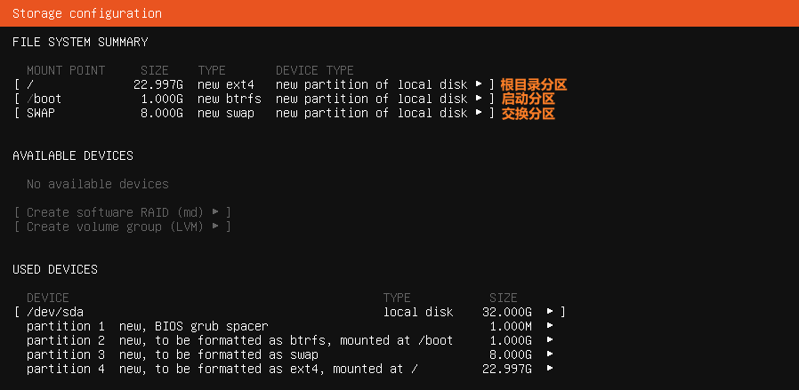
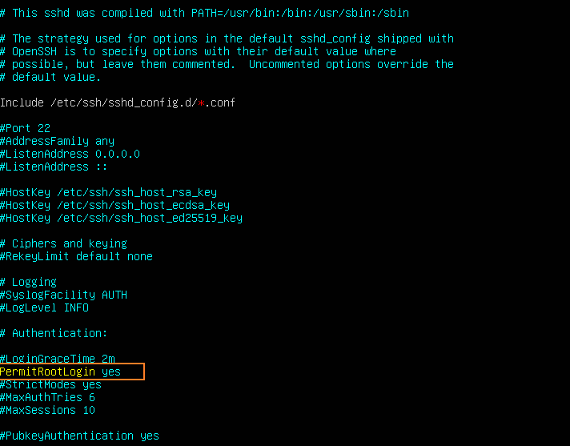

一个好用的Linux系统对于程序员来说是必须的，不管是Ubuntu、SUSE还是Centos都是可以的。

<!--more-->

## 1. 下载Ubuntu ISO文件

前往[Ubuntu官网](https://ubuntu.com/download/alternative-downloads)下载Ubuntu，建议下载[Ubuntu Server 20](magnet:?xt=urn:btih:3057AD5D5DF45FE07DBCBCA184EC4276D3068A2E)，这是个磁力连接嗷，原来的直连下载不知道哪去了。

> 下载完成后在VMWare中安装。不建议VirtualBOX或者物理机安装双系统，因为真的没有用而且浪费时间，本人亲身经历，安装过Ubuntu、Kubuntu、Mint、Deepin、OpenSUSE、Manjaro、Arch，后来即使是用熟练了，效率也远不如Windows。所以，听哥一句劝，安在VMWare上用用就好了。如果想体验一下使用Linux系统做开发的话，建议在VMWare上安装有图形界面的Ubuntu、MINT等。不得不说，Ubuntu系在VMWare上的优化还是很好的，动画相当的流畅。

## 2. 安装Ubuntu Server

在VMWare中新建虚拟机，选择安装。推荐配置是2核+4G+32G。网络使用NAT地址转换，使用一个VMWare虚拟的网卡，使用的IP地址也是独立于已有的局域网网络号，一般来说是`192.168.203.0/24`。

正式进入Ubuntu Server的安装界面。在设置Mirror时，推荐使用阿里源:
```
http://mirrors.aliyun.com/ubuntu
```

磁盘分区推荐如下图所示：



## 3. 配置SSH连接方式

### 1. 配置IP地址

想要远程连接Ubuntu Server，最重要的莫过于配置可达的IP地址。首先，安装网络工具，有了这个工具，我们才能使用`ifconfig`命令。

```bash
sudo apt-get install net-tools
```

然后，修改网卡配置文件。

```bash
sudo vim /etc/netplan/00-installer-config.yaml
```

修改为如下配置，其中gateway4可以通过`route -n`命令查看：

```yml
# This is the network config written by 'subiquity'
network:
  ethernets:
    ens33:
      dhcp4: no
      optional: true
      addresses: [192.168.203.150/24] # must be CIDR
      gateway4: 192.168.203.2
      nameservers:
              addresses:
                - 192.168.203.2
  version: 2
  renderer: networkd
```

最后，使配置文件生效。

```bash
sudo netplan apply
```

### 2. 配置SSH

最终使用Ubuntu Server的方式，肯定是通过SSH连接。因此，我们需要配置ssh连接方式。

安装openssh-server，使得Ubuntu Server称为openssh的服务端。

```bash
sudo apt-get install openssh-server
```

修改openssh-server的配置文件``，使得允许在远程以root用户登录。虽然建议以非root用户登录，但是我们这是自己测试用的虚拟机，不是生产环境，无所谓的，root反而能提供更多的方便。

```bash
sudo vim /etc/ssh/sshd_config
```

修改PermitRootLogin为yes，如下所示。



然后，重启sshd。

```bash
sudo service sshd restart
```

此时，我们依然无法登录root账号，因为我们还没有给root账号设置密码。

```bash
sudo passwd root
```

这样就可以在windows终端登录ubuntu server了。

```powershell
ssh root@192.168.203.150
```

事实上，最推荐最安全最快捷的登录方式是使用公私钥登录，而非密码登录。只需要将公钥加入文件` ~/.ssh/authorized_keys`最后新建一行即可。