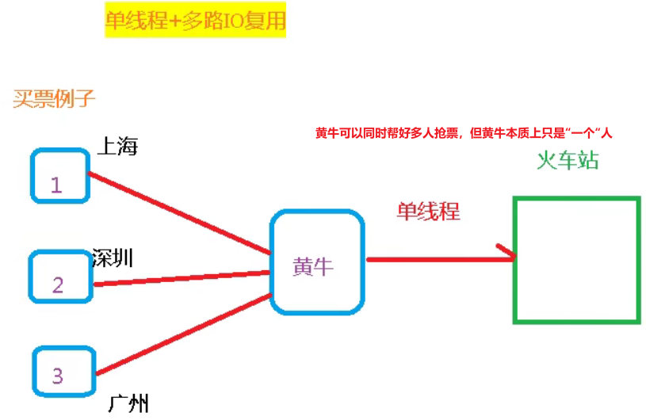

Redis即Remote Dictory Server，远程字典服务。本文参考了《Redis开发与运维》。

<!--more-->

## 1. Redis安装

Redis是某个程序员个人开发的，最初用于满足他自己项目中的高性能队列，取代了项目中原来的MySQL实现的低性能队列。因此，Redis本身只有基于POSIX系统的Linux版本和MacOS版本，而没有Windows版本。虽然Windows团队专门维护了运行于Windows的Redis版本，但是不推荐使用。在Windows操作系统下推荐安装Linux虚拟机来安装Redis。

下面是在Linux操作系统上安装Redis-6.2.5的过程。

```bash
cd /usr/local/src/
wget https://download.redis.io/releases/redis-6.2.5.tar.gz
tar -zxvf redis-6.2.5.tar.gz
cd redis-6.2.5
apt install gcc
apt install make
make && make install
```

默认可执行文件在目录`/usr/local/bin`下。目录中存放的redis相关执行文件如下。

```
root@Ubuntu21-VM:/opt/redis-6.2.6# ll /usr/local/bin | grep redis
-rwxr-xr-x  1 root root  7001144 12月 17 18:48 redis-benchmark*
lrwxrwxrwx  1 root root       12 12月 17 18:48 redis-check-aof -> redis-server*
lrwxrwxrwx  1 root root       12 12月 17 18:48 redis-check-rdb -> redis-server*
-rwxr-xr-x  1 root root  6956256 12月 17 18:48 redis-cli*
lrwxrwxrwx  1 root root       12 12月 17 18:48 redis-sentinel -> redis-server*
-rwxr-xr-x  1 root root 12703896 12月 17 18:48 redis-server*
```

## 2. Redis启动

### 1. 前台启动

```bash
redis-server
```

### 2. 后台启动

```bash
cp /usr/local/src/redis-6.2.5/redis.conf /etc/
vim /etc/redis.conf
```

修改`daemonized no`为`daemonized yes`。

```bash
redis-server /etc/redis.conf
```


```bash
redis-cli [-h 127.0.0.1] [-p 6379]
> shutdown # 关闭
# or 
kill -9 <PID>
```

### 3. 设置密码

修改配置文件。

```apache
requirepass 123
```

或者通过命令设置密码。

```bash
config set requirepass 123
config get requirepass
```

输入密码也有两种方式：

1. 连接时输入密码
    ```bash
    redis-cli -a 123
    ```

2. 连接后输入密码
   ```bash
   auth 123
   ```

   

## 3. Redis特点

单线程+多路IO复用。并不是实现不了多线程，而是为了增加CPU使用率才特意弄成单线程。Redis快的原因：
1. 纯内存访问。
2. 非阻塞I/O。
3. 单线程避免了竞态条件和线程切换。



## 4. 五大数据类型

Redis五大基本数据类型是[string](#1-string)、[hash](#2-hash)、[list](#3-list)、[set](#4-set)、[zset](#5-zset)。在学习五大基本数据类型之前，先掌握通用的Redis命令。

```bash
keys * # 查看当前库的所有key
scan 0 # 渐进式遍历所有key
exits key # 判断key是否存在
type key # 查看元素类型
del key # 删除key指定的数据
unlink key # 非阻塞删除

expire key 10 # 给key设置10秒的过期时间
pexpire key 10000 # 给key设置毫秒级的过期时间
expireat key 1469980800 # 设置秒级的过期时间戳
ttl key # 查看还有多少秒过期，-1永不过期、-2已经过期
pttl key # 查看还有多少毫秒过期
persist key # 取消过期时间

select 1 # 切换数据库
dbsize # 查看当前库中有多少key
flushdb # 清空当前库
flushall # 清空所有库中的内容

object encoding key_name # 查看数据结构的内部编码

move key db # 将键移动到目标数据库，只能用于同一个redis服务内

dump key
restore key 10 "\x00\x15hello, dumping world!\x06\x00E\xa0Z\x82\xd8r\xc1\xde"

migrate host port key|"" dest-db timeout [copy] [replace] [keys key [key ...]]

```

### 1. String

一个key对应一个value。string可以存储字符串、数字。string也是二进制安全的，可以存图片或者其序列化对象，但最大不能超过512MB。

```bash
set k1 v100 # 可覆盖值，同时会将过期时间清除
get k1
append k1 abc # "v100abc"
strlen k1
setnx k2 v200 # 只能创建新的，不能覆盖
setex k2 10 v300 # 同时设置过期时间，是原子操作
set k3 100
incr k3 # +1, 是一个原子操作，不会被线程调度机制打断。而Java不是
decr k3 # -1
incrby k3 10 # +10
decrby k3 10 # -10
```

注意到setnx只能创建新的键，不能覆盖原来的键。那么当多个客户端同时对相同的键执行setnx命令，则只有第一个客户端可以成功，其他客户端都失败。因此setnx可以作为分布式锁的一种实现方案。


```bash
mset k1 v1 k2 v2
# 原子操作，一个失败，其他都失败
msetnx k3 v3 k4 v4

set k1 helloworld
getrange k1 0 4 # 起始位置、结束位置，两侧都是闭区间 hello
setrange k 2 mmm # hemmmworld

setex age 20 value30 # 设置值的同时设置过期时间
getset k1 jack # 返回旧值，并设置新值
```

string底层结构为动态字符串SDS，即可修改字符串。本质类似Java的ArrayList，采用已分配冗余空间来减少内存的频繁分配。字符串的最大长度为512M。


### 2. Hash

Redis Hash是一个键值对集合，field-value的映射关系，类似Java里的`Map<String, Object>`。特别适合存储对象。

```json
user:0001 {
    id: 1,
    name: SeekWind,
    age: 21
}
```

上述对象可以存储为：

```bash
hset user:0001 id 1 name SeekWind age 21
hget user:0001 id
hexists user:0001 name # 判断name是否存在
```

```bash
hkeys user:0001 # 查看所有field
hvals user:0001 # 查看所有value
hgetall user:0001 # 查看所有field和value
hincrby user:0001 id 4 # 将 id += 4
hsetnx user:0001 gender female # 新增加原本不存在的值
```

hash底层是ziplist（压缩列表）、hashtable（哈希表）。当field-value长度较短且个数较少时，使用ziplist，否则使用hashtable。ziplist的大小取决于内存页帧的大小。

### 3. List

单键多值。底层是一个快速双向链表，两端查询性能很高，按索引查值的性能略低。

```bash
lpush k1 v1 v2 v3 # v3 -> v2 -> v1，相当于是从链表左边压栈。
lrange k1 0 -1 # lrange <key> <start> <stop>（闭区间），-1代表获取所有值，v3 v2 v1
lpop k1 3 # v3, v2, v1。值在键在，值光键亡。
# 还有类似的rpush rpop
rpoplpush k1 k2 # 将k1右侧的值弹出，压入k2左侧
llen k1 # 获取列表长度
```

```bash
linsert k1 before|after v1 haha # 将第一个v1替换成haha
lrem k1 2 v1 # 从左侧删除至多2个v1（取决于够不够2个v1）
lset k1 0 v5 # 将下标为0的元素替换成v5
```


快速链表的每个部分是一个压缩链表。

### 4. Set

set集合也是一个列表。但它是无序的，且能够自动排重。

```bash
sadd k1 v1 v2 v3 # 添加元素，自动去重
smembers k1 # 查看所有元素
sismember k1 v4 # 查看k1中是否有v4
scard k1 # 查看集合中元素个数
```

```bash
srem k1 v1 v2 # 删除集合中的元素
spop k1 # 随机从集合中吐出一个值
srandmember k1 2 # 随机从集合中返回2个值，不会从集合中删除
smove k1 k2 v1 # 将k1中的v1转移到k2中
sinter k1 k2 k3 # 返回多个集合的交集元素
sunion k1 k2 k3 # 返回多个集合的并集
sdiff k1 k2 k3 # 返回k1 - k2 - k3的元素
```

Set数据结构是字典，底层是一个value为null的HashMap。在Java中HashSet的内部实现使用的是HashMap，只不过所有的value都指向同一个对象，Redis的set结构也是一样的，内部HashMap的value都指向同一个内部值。

### 5. Zset

与set极其类似，但存放元素是有序的。每个成员都关联了一个**评分**，这个评分被用于按照从最低分到最高分的方式排序集合中的成员。

```bash
zadd topn 200 java 300 c++ 400 mysql 500 php # 注意，评分在前，内容在后
zrange topn 0 -1 withscores # 返回从小到大的下标在某个区间内的值
zrangebyscore topn 200 400 withscores # 返回从小到大的某个区间内的值
zrevrangebyscore topn 400 200 withscores # 返回从大到小的某个区间内的值
```

```bash
zincrby topn java 50 # 为java的score增加50
zrem key topn java # 删除java
zcount topn 200 400 # 返回200至400之间的元素个数
zrank topn java # 返回0，因为java是最小的（默认下标从0开始）
```

zset可以制作一个文章访问量的排行榜（zrange）。

zset类似java的`Map<String, Double>`。底层使用了两个数据结构：

1. Hash，用于关联元素value和权重score，保障元素value的唯一性，可以通过元素的value找到相应的score值。
2. 跳跃表，跳跃表的目的在于给元素value排序，根据score的范围获取元素列表。跳表的结构如下所示。


## 5. Redis配置文件

```bash
######### Network ########
# bind 127.0.0.1 ::1 将其注释，代表允许来自任何客户端的连接
protected-mode no # 修改为 no，表示支持远程连接
tcp-backlog 511 # 表示未完成三次握手与已完成三次握手的队列数量的总和为511
timeout 0 # 连接redis后未操作自动断开连接时间，0表示不会自动断开
tcp-keepalive 300 # redis服务端向客户端发送ACK包的频率，用于确认客户端是否还存活

######### General ########
daemonize yes # 是否开启redis后台启动
pidfile /var/run/redis_6379.pid # redis进程号保存的文件

loglevel notice # debug verbose notice warning 四个日志级别
logfile /var/redis/redis_6379.log # 日志文件的保存位置
database 16 # 默认的数据库数量

######### Security ########
maxclients 10000 # 设置redis同时可以与多少个客户端进行连接，默认10000
maxmemory-policy # 设置最大内存。溢出部分数据将会根据LRU或最小TTL进行移除。
```

修改密码。

```bash
config get requirepass
config set requirepass "123456"
auth 123456
```

## 6. Redis发布订阅通信模式

发送者发送消息，订阅者接收消息。例如，在社交平台上，你能收到你关注的人发布的动态。

订阅者可以订阅任意数量的频道。


```bash
# Redis客户端1
subsribe channel1
```

```bash
# Redis客户端2
publish channel1 hello
# 发送完成后，客户端1会收到消息
```

## 7. Redis3新数据类型

### 1. Bitmaps

可位操作的二进制串。本质上并不是一种新的数据结构，而是字符串。你可以对字符串变量使用下述位操作。由于其特性，我们更加推荐在用户活跃比例高的情况下使用Bitmaps。


```bash
setbit unique:users:20210928 3 1 # 将第4位设为1，如果指定的偏移量过大，整个初始化会很慢，造成Redis阻塞
getbit unique:users:20210928 3
bitcount unique:users:20210928 <start> <end> # 统计1的个数，可以加上统计区间，区间可以使用负数，代表倒数第几个
```

```bash
bitop and k k1 k2 # 将k1 k2做按位与
bitop or k k1 k2 # 将k1 k2做按位或

bitpos k 1 0 5 # 返回在第0至5个字节中寻找第一个值为1的偏移
```


### 2. HyperLogLog

HyperLogLog可以做基数统计，其优点是：即使我们输入很大的元素（数量或体积），计算基数所需的空间是固定的很小的。HyperLogLog只需要花费12KB内存就可以计算接近$2^{64}$个不同元素的基数。

值得注意的是，HyperLogLog并不会保存数据元素本身，只会计算基数。

```bash
pfadd k1 "a" "b" "c" "a" # 添加元素
pfadd k2 "d" "e" "f" 
pfcount k1 # 计算基数，3
pfmerge k k1 k2 # 合并k1 k2
pfcount k # 基数为，6
```

事实上，HyperLogLog只能对基数做估计，也就是说，结果会存在一定的误差，Redis官方给出的误差率是0.81%。

### 3. Geospatial

Redis3.2就增加了GEO类型的支持。GEO，geographic，地理信息的缩写，本质上是元素的二维坐标，在地图上即是经纬度。Geospatial即是基于GEO开发的，提供了针对经纬度的设置、查询、范围查询、距离查询、经纬度Hash等常见操作。

```bash
geoadd china:city 121.47 31.23 shanghai 114.05 22.52 shenzhen 116.38 39.90 beijing # 有效纬度从-180至180，有效经度从-85.05112878到85.05112878，超出范围就Error

geopos china:city beijing # 取出经纬度
geodist china:city beijing shanghai km # 北京到上海的距离，单位是km
georadius china:city 110 30 1000 km # 取出以经纬度为110 30为中心半径为1000km的城市
```

## 8. Jedis

在连接远程redis时，需要修改配置文件并关闭防火墙。

```
# bind 127.0.0.1 -::1
protected-mode no
```

```bash
systemctl stop firewalld # 暂时关闭防火墙
kill -9 <redis-PID>
redis-server /etc/redis.conf
```

创建Maven项目，添加POM依赖。

```xml
<dependencies>
    <dependency>
        <groupId>redis.clients</groupId>
        <artifactId>jedis</artifactId>
        <version>3.2.0</version>
    </dependency>
</dependencies>
```

创建Java main类。

```java
package xyz.seekwind.jedisdemo;

import org.junit.Test;
import redis.clients.jedis.Jedis;

import java.util.Set;

public class JedisDemo1 {
    public static void main(String[] args) {
        Jedis jedis = new Jedis("192.168.203.101", 6379);
        jedis.auth("123");
        System.out.println(jedis.ping()); // 输出PONG说明连接成功
        jedis.close();
    }
    @Test
    public void demo1() {
        Jedis jedis = new Jedis("192.168.203.101", 6379);
        jedis.auth("123");
        Set<String> keys = jedis.keys("*");
        for (String key : keys) {
            System.out.println(key);
        }
        jedis.close();
    }
}
```

Jedis操作Redis的API与Redis-cli操作十分相似，如下所示，在此不做过多介绍。

```java
jedis.set("name", "SeekWind");
```

### 1. 案例：模拟发送手机验证码

```java
package xyz.seekwind.jedisdemo;

import org.junit.Test;
import redis.clients.jedis.Jedis;

import java.text.SimpleDateFormat;
import java.util.*;

public class VertifyCode {
    public static final int VERTIFY_CODE_LENGTH = 6;
    private static final Random RANDOM = new Random();

    public static void main(String[] args) {
        String phone = "12345678901";
        VertifyCode vertifyCode = new VertifyCode();
        Jedis jedis = new Jedis("192.168.203.101", 6379);
        if (vertifyCode.vertifyCode(phone, jedis)) {
            String code = vertifyCode.getRandomVertifyCode();
            System.out.println(code);
        }
        jedis.close();
    }

    // 一天发送验证码不能超过三次
    // 使用set VertifyCode<PHONE>:time格式的set来存储验证码发送次数
    public boolean vertifyCode(String phone, Jedis jedis) {
        String phoneKey = String.format("VertifyCode<%s>:Counts", phone);
        String phoneValue = jedis.get(phoneKey);
        // 如果不存在记录，则创建记录
        if (phoneValue == null) {
            // 过期时间是24小时
            jedis.setex(phoneKey, 24*60*60,String.valueOf(1));
        }
        else {
            int phoneCount = Integer.parseInt(phoneValue);
     		// 发送验证码不允许超过三次
            if (phoneCount < 3) {
                jedis.incr(phoneKey);
            }
            else {
                System.out.printf("Sorry, the phone <%s> count is out of limite.%n", phone);
                return false;
            }
        }
        return true;
    }

    public String getRandomVertifyCode() {
        StringBuilder sb = new StringBuilder();
        for (int i = 0 ; i < VERTIFY_CODE_LENGTH ; i ++) {
            sb.append(RANDOM.nextInt(10));
        }
        return sb.toString();
    }
    @Test
    public void test() {
        String time = new SimpleDateFormat("yyyy-MM-dd HH:mm:ss").format(new Date());
        System.out.println(time);
    }
}
```

### 2. 案例：Spring Boot整合Redis

```properties
# 应用名称
spring.application.name=redis-spring-boot-demo

spring.redis.host=192.168.203.101
spring.redis.port=6379
spring.redis.database=0
spring.redis.timeout=1800000
# 连接池的最大连接数
spring.redis.lettuce.pool.max-active=20
# 最大阻塞等待时间，负数代表无限制
spring.redis.jedis.pool.max-wait=-1ms
# 连接池中最大空闲连接
spring.redis.lettuce.pool.min-idle=5
spring.redis.password=123456
```

```xml
        <dependency>
            <groupId>org.springframework.boot</groupId>
            <artifactId>spring-boot-starter-web</artifactId>
            <version>2.5.4</version>
        </dependency>
        <dependency>
            <groupId>org.springframework.boot</groupId>
            <artifactId>spring-boot-starter-data-redis</artifactId>
        </dependency>
```

```java
package xyz.seekwind.redisspringbootdemo.config;

import org.springframework.cache.CacheManager;
import org.springframework.cache.annotation.EnableCaching;
import org.springframework.context.annotation.Bean;
import org.springframework.context.annotation.Configuration;
import org.springframework.data.redis.core.RedisTemplate;

@Configuration
@EnableCaching//开启注解
public class RedisConfig {
    @Bean
    public CacheManager cacheManager(RedisTemplate<?, ?> redisTemplate) {
        CacheManager cacheManager = new RedisCacheManager(redisTemplate);
        return cacheManager;
        /*RedisCacheManager rcm = new RedisCacheManager(redisTemplate);
        // 多个缓存的名称,目前只定义了一个
        rcm.setCacheNames(Arrays.asList("thisredis"));
        //设置缓存默认过期时间(秒)
        rcm.setDefaultExpiration(600);
        return rcm;*/
    }
    // 以下两种redisTemplate自由根据场景选择
    @Bean
    public RedisTemplate<Object, Object> redisTemplate(RedisConnectionFactory connectionFactory) {
        RedisTemplate<Object, Object> template = new RedisTemplate<>();
        template.setConnectionFactory(connectionFactory);

        //使用Jackson2JsonRedisSerializer来序列化和反序列化redis的value值（默认使用JDK的序列化方式）
        Jackson2JsonRedisSerializer serializer = new Jackson2JsonRedisSerializer(Object.class);

        ObjectMapper mapper = new ObjectMapper();
        mapper.setVisibility(PropertyAccessor.ALL, JsonAutoDetect.Visibility.ANY);
        mapper.enableDefaultTyping(ObjectMapper.DefaultTyping.NON_FINAL);
        serializer.setObjectMapper(mapper);

        template.setValueSerializer(serializer);
        //使用StringRedisSerializer来序列化和反序列化redis的key值
        template.setKeySerializer(new StringRedisSerializer());
        template.afterPropertiesSet();
        return template;
    }
    @Bean
    public StringRedisTemplate stringRedisTemplate(RedisConnectionFactory factory) {
        StringRedisTemplate stringRedisTemplate = new StringRedisTemplate();
        stringRedisTemplate.setConnectionFactory(factory);
        return stringRedisTemplate;
    }
}
```

```java
package xyz.seekwind.redisspringbootdemo.controller;

import org.springframework.beans.factory.annotation.Autowired;
import org.springframework.web.bind.annotation.GetMapping;
import org.springframework.web.bind.annotation.RestController;

@RestController
public class RedisController {
    @Autowired
    private RedisTemplate redisTemplate;

    @GetMapping("/redisTest")
    public String redisTest() {
        redisTemplate.opsForValue().set("name", "SeekWind");
        Object name = redisTemplate.opsForValue().get("name");
        return name;
    }
}
```

## 9. Redis事务与锁

Redis事务是一个单独隔离的操作，事务中所有的命令都会被序列化、按顺序执行。事务在执行过程中，不会背其他客户端发送来的命令请求打断。

Redis事务的主要作用就是串联多个命令防止别的命令插队，与MySQL中的事务不太一样。

创建一个事务到提交如下所示。

```bash
multi # 启动排队（事务）
set k1 v1
set k2 v2
exec # 执行（提交事务）
```

当然，事务是可以回滚的。

```bash
multi # 启动排队（事务）
set k1 v1
set k2 v2
discard # 回滚事务
```

### 1. 编译期错误与运行时错误

在事务中，如果一条语句发生了错误，那么事务中的所有语句都执行失败？不一定。分为编译期错误和运行时错误。

```bash
multi
set k1 v1
set k2 # 缺少值，发生编译期错误，事务中所有语句运行失败
exec
```

```bash
multi
set k1 v1
incr k1 # k1是字符串类型，非整型，不能执行自增操作，属于运行时错误
exec
```

### 2. 事务冲突

悲观锁：每次操作之前都上锁。

乐观锁：适合多读的系统。


Session1

```bash
watch k1
multi
incr k1
exec
```

```bash
watch k1
multi
incr k1
exec
```


还有个类似的命令`unwatch`，用于取消对变量的监视。

### 3. 事务的三特性

* 单独的隔离操作：事务中的所有命令都会序列化、按顺序地执行。在事务执行的过程中，不会被其他客户端发送来的命令请求所打断。
* 没有隔离级别的概念：队列中的命令没有提交之前都不会被实际执行，因为事务提交前任何指令都不会实际被执行。
* 不保证原子性：事务中如果有一条命令发生运行时失败，其后续命令仍然会执行，没有回滚。

## 10 .Redis持久化

提供了两种持久化方法：RDB、COF。

### 1. RDB

Redis Database，采用的技术称为**写时复制技术**。


```apache
# 当磁盘满时停止写入操作
stop-writes-on-bgsave-error yes
# 持久化数据的文件名，该文件将保存在redis-server的启动目录。在home启动就会生成~/dump.rdb
dbfilename dump.rdb
# 是否对rdb文件压缩，消耗一定的cpu性能
rdbcompression yes
# 临时文件区向dump.rdb同步数据时，是否开启完整性检查，消耗10%性能，一定要开启
rdbchecksum yes
```

```apache
# 3600秒内多于一次修改，则3600秒Fork子进程一次
save 3600 1
# 300秒内多于100次修改，则300秒Fork子进程一次
save 300 100
# 60秒内多于10000次修改，则60秒Fork子进程一次
save 60 10000
```

RDB的优点是主进程不进行任何IO操作，确保了极高的性能。

RDB的缺点是最后一次持久化后的数据可能会丢失。例如现在有200个key进行了修改，然而时间还未到300秒，那么此时服务器突然kill了，这200条修改就没了。

### 2. AOF

Append Only File，只保存写操作的命令，而不保存读操作。RDB与AOF都开启时，默认使用AOF的数据。

```apache
# 开启aof
appendonly yes
# aof 文件名，保存位置与rdb一致
appendfilename "appendonly.aof"
```

```bash
# 修复AOF文件
redis-check-aof --fix appendonly.aof
```

同步频率设置。

```apache
# 每次写操作都会立即同步,fsync sys call在每次执行命令后立刻执行
# appendfsync always

# 执行命令后，先执行write sys call，将命令写入linux内核的系统缓冲区。每秒同步写入硬盘，即每秒执行fsync
# 最推荐
appendfsync everysec 

# 把同步时机交给操作系统
# appendfsync no
```

重写机制：将多条命令压缩成一条命令，只关注结果，不关注过程。当AOF文件大小超过基础大小的100%（默认）时，会触发重写压缩操作。例如基础大小为64MB，那么当AOF文件大小达到128MB时，会重写压缩。

```bash
set k1 v1
set k2 v1
# 重写压缩后
set k1 v1 k2 v2
```

优点：备份机制更加稳健，丢失数据概率更低。可读的日志文本，通过操作AOF文件，可以处理误操作。

缺点：比RDB占用更多的磁盘空间。恢复备份速度慢。每次读写都同步的话，有一定的性能压力。

Redis持久化中最耗时的操作是fork。在RDB中，需要fork子进程来持久化数据，而在AOF中需要fork子进程来操作重写AOF文件。而Linux有copy-on-write技术，在fork的子进程进行持久化操作时，直接从父进程的内存快照中读取，当父进程需要写入时，会复制一页内存页副本完成写操作。待子进程完毕后，在将副本写入原始的内存页。详见《Redis开发与运维》P162

## 11. 主从复制

Master写，Slaver读。

### 1. 一主二从

Master配置：

```apache
pidfile /var/run/redis6379.pid
port 6379
logfile "6379.log"
```

Slaver配置：

```apache
pidfile /var/run/redis6380.pid
port 6380
logfile "63780.log"

pidfile /var/run/redis6381.pid
port 6381
logfile "63781.log"
```

启动三个redis服务。

```bash
redis-server /etc/redis-6379.conf
redis-server /etc/redis-6380.conf
redis-server /etc/redis-6381.conf
```

进入redis-cli，查看该服务信息

```bash
info replication

# Replication
role:master
connected_slaves:0
master_failover_state:no-failover
master_replid:d321605828da2a67cd28f86566b96617eb150a5a
master_replid2:0000000000000000000000000000000000000000
master_repl_offset:0
second_repl_offset:-1
repl_backlog_active:0
repl_backlog_size:1048576
repl_backlog_first_byte_offset:0
repl_backlog_histlen:0
```

在redis-cli中临时设置主从，主机可以读写，从机只能读。

```bash
slaveof 127.0.0.1 6379
```

### 2. 一主一从一从

6380 Redis

```bash
slaveof 127.0.0.1 6379
```

6381 Redis

```bash
slaveof 127.0.0.1 6380
```


### 3. 从机变成主机（反客为主）

假设一主二从的结构，主机挂了，此时从机6380执行：

```bash
slaveof no one
```

6381执行：

```bash
slaveof 127.0.0.1 6380
```

此时，6380为主机，6381为从机。

### 4. 复制原理


### 5. 哨兵模式

反客为主的自动版。

```apache
# sentinel.conf，监控6379主机，一旦挂了，从机票数超过1票的就是主机
sentinel monitor host6379 127.0.0.1 6379 1
```

启动哨兵。

```bash
redis-sentinel /etc/sentinel.conf
```

此时如果主机挂了，那么不超过一分钟，哨兵就会选出新的主机。

## 12. Redis集群

主从复制相当于是对Redis的垂直扩容，因为不同Redis服务的功能不同，有的是负责写的主机，有的是负责读的从机。

而Redis集群相当于是对Redis的水平扩容，将数据平衡的存储到N个redis节点中。集群中即使有几个节点坏了，不会影响其他请求的处理。

### 1. 运行Redis集群

安装ruby，运行redis集群。

```bash
apt install rubygems
gem install redis
```

安装完ruby环境后，就可以运行`/usr/local/redis/src/`中的`redis-trib.rb`文件了。

多个redis节点的配置文件做如下修改，当然，端口号需要修改。

```apache
# 打开集群模式
cluster-enabled yes
# 设置节点配置文件名
cluster-config-file nodes-6379.conf
# 设置节点失联时间，超过该时间（ms），集群自动进行主从切换
cluster-node-timeout 15000
```

启动多个redis节点。

```bash
redis-server /etc/redis-6379.conf
redis-server /etc/redis-6390.conf
redis-server /etc/redis-6391.conf
redis-server /etc/redis-6391.conf
redis-server /etc/redis-6393.conf
redis-server /etc/redis-6394.conf
```

然后，在启动目录下观察`nodes*.conf`文件能否自动生成。最后运行如下命令，将所有redis节点形成一个集群。

```bash
./redis-trib.rb create --replicas 1 192.168.203.101:6379 192.168.203.101:6390 192.168.203.101:6391 192.168.203.101:6392 192.168.203.101:6393 192.168.203.101:6394
```

我们通过redis-cli连接任意一个redis。

```bash
redis-cli -p 6379
```

```bash
cluster nodes
```

此时，当我们每操作一个key，redis都会经过Hash运算，得到key值对应的一个Hash Slot插槽，redis一共有16384个插槽，redis会寻找插槽对应的节点进行操作。


```bash
set k1{user} v1
set k2{user} v2
set k3{user} v3
```


然而可以在redis.conf配置文件中设置`cluster-require-full-coverage no`，来使得即使部分节点slot失效，其他节点上的数据依然能正常访问。

> 有关Redis集群的更多信息，详见[Redis-3.2.0集群配置（redis cluster） - luckc# - 博客园 (cnblogs.com)](https://www.cnblogs.com/luckcs/articles/6669255.html)

### 2. Jedis集群开发

```java
Set<HostAndPort> nodes = new HashSet<>;
ndoes.add(new HostAndPort("192.168.203.101"), 6379);
ndoes.add(new HostAndPort("192.168.203.101"), 6390);
ndoes.add(new HostAndPort("192.168.203.101"), 6391);
ndoes.add(new HostAndPort("192.168.203.101"), 6392);
ndoes.add(new HostAndPort("192.168.203.101"), 6393);
ndoes.add(new HostAndPort("192.168.203.101"), 6394);
JedisCluster cluster = new JedisCluster(nodes);
cluster.set("username", "admin");
cluster.close();
```


## 13. Lua Script


