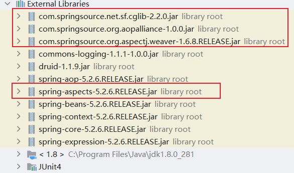
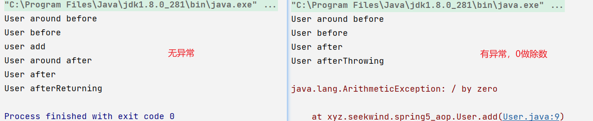
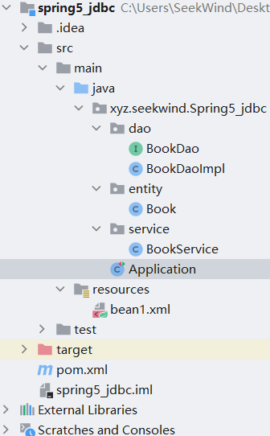
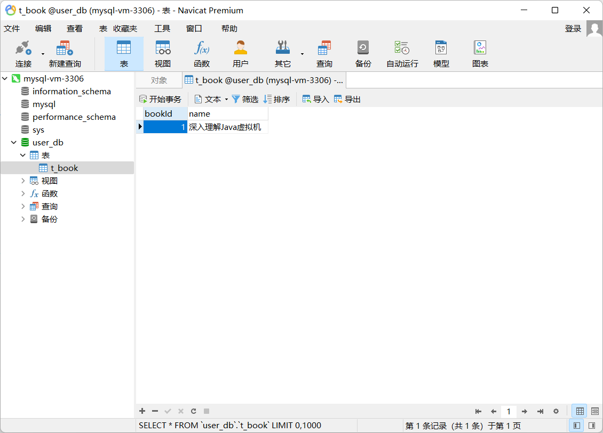
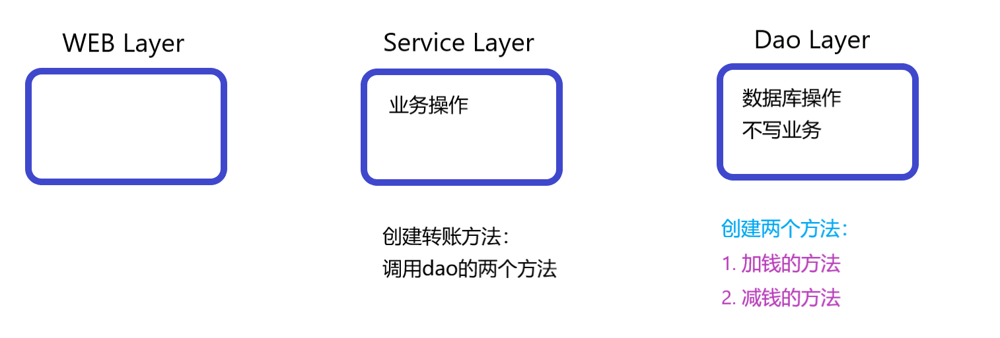
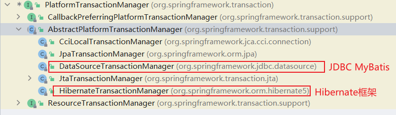

在软件业，AOP为Aspect Oriented Programming的缩写，意为：**面向切面编程**，通过预编译方式和运行期间动态代理实现程序功能的统一维护的一种技术。

<!--more-->

## 1. AOP API

AOP是OOP的延续，是软件开发中的一个热点，也是Spring框架中的一个重要内容，是**函数式编程**的一种衍生范型。利用AOP可以对业务逻辑的各个部分进行隔离，从而使得业务逻辑各部分之间的耦合度降低，提高程序的可重用性，同时提高了开发的效率。

AOP的核心是：不改变类的源代码的情况下，增强类的方法。

### 1. 底层原理

动态代理。有两种情况：

- 被代理的类有父接口：使用JDK动态代理。创建接口实现类的代理对象，增强类的方法。
- 被代理的类无父接口：使用CGLIB动态代理。动态生成字节码，来构造一个被代理类的子类。因此它不能用于final方法或者final类。

### 2. JDK动态代理

创建一个接口UserDao和其实现类UserDaoImpl，使用`Proxy.newProxyInstance()`方法创建一个增强的代理类，用于增强接口的功能。

```java
package xyz.seekwind.spring5_aop.dao;

public interface UserDao {
    int add(int a, int b);
    String update(String id);
}
```

```java
package xyz.seekwind.spring5_aop.dao;

public class UserDaoImpl implements UserDao {
    @Override
    public int add(int a, int b) {
        System.out.println("UserDaoImpl ADD method");
        return a + b;
    }

    @Override
    public String update(String id) {
        System.out.println("UserDaoImpl UPDATE method");
        return id;
    }

}
```

```java
package xyz.seekwind.spring5_aop;

import org.junit.Test;
import xyz.seekwind.spring5_aop.dao.UserDao;
import xyz.seekwind.spring5_aop.dao.UserDaoImpl;

import java.lang.reflect.InvocationHandler;
import java.lang.reflect.Method;
import java.lang.reflect.Proxy;

public class TestUnit {

    @Test
    public void test() {
        // 返回一个代理类，增强了代理的方法。
        UserDao userDao = (UserDao) Proxy.newProxyInstance(
            UserDao.class.getClassLoader(), 
            new Class[]{UserDao.class}, 
            new MyInvocationHandler(new UserDaoImpl())
        );

        userDao.add(1,2);
        userDao.update("1234");
    }
}

// 执行代理方法的处理器
class MyInvocationHandler implements InvocationHandler {

    private Object obj;

    public MyInvocationHandler(Object obj) {
        this.obj = obj;
    }

    // 增强了被代理类的功能
       // 参数1：最终使用的代理类
    // 参数2：当前的方法。在本例中，可以指代add或update，动态指向方法通过反射实现
    // 参数3：参数列表
    @Override
    public Object invoke(Object proxy, Method method, Object[] args) throws Throwable {
        // 在执行被增强方法之前，需要执行的内容
        // before execute the method
        System.out.println("Before execute the method.");

        // 此处执行的是被代理类的方法。可以根据method.getName()做if判断，以针对不同的方法做不同的增强。
        // 返回值是原函数的返回值
        // execute the method
        Object res = method.invoke(obj, args);

        // 在执行被增强方法之后，需要执行的内容
        // after execute the method
        System.out.println("After execute the method.");

        return res;
    }
}
```

### 3. AOP术语

1. JoinPoint连接点：类里面可以被增强的方法，称为连接点
2. PointCut切入点：实际被真正增强的方法，称为切入点
3. Advice通知（增强）：实际增强逻辑的部分，称为通知或增强。通知有多种类型：
  - 前置通知：@Before
  - 后置通知：@After
  - 环绕通知：@Around
  - 异常通知：@AfterThrowing
  - 最终通知：@AfterReturning
4. Aspect切面：把通知应用到切入点的过程。例如把权限判断加入到登录功能的这个过程。

### 4. AspectJ

Spring框架一般是基于AspectJ实现AOP操作，但需要注意的是，AspectJ不是Spring的一部分。Spring自带的AOP称为Spring AOP。基于AspectJ实现AOP操作有两种方式：XML和注解。

所使用的所有依赖如下所示。



切入点表达式：用一个表达式来指定，哪些类的哪些方法是需要被增强的。

#### 1. AspectJ注解方式

1. 配置自动扫描bean与自动动态代理。

```java
package xyz.seekwind.spring5_aop.config;

import org.springframework.context.annotation.ComponentScan;
import org.springframework.context.annotation.Configuration;
import org.springframework.context.annotation.EnableAspectJAutoProxy;

@Configuration
@ComponentScan(basePackages = "xyz.seekwind.spring5_aop")
@EnableAspectJAutoProxy(proxyTargetClass = true) // 不写参数默认是true
public class MyConfig {
}
```

也可以用xml方式。

```xml
<?xml version="1.0" encoding="UTF-8"?>
<beans xmlns="http://www.springframework.org/schema/beans"
       xmlns:xsi="http://www.w3.org/2001/XMLSchema-instance"
       xmlns:context="http://www.springframework.org/schema/context"
       xmlns:aop="http://www.springframework.org/schema/aop"
       xsi:schemaLocation=
       "http://www.springframework.org/schema/beans 
        http://www.springframework.org/schema/beans/spring-beans.xsd
        http://www.springframework.org/schema/context 
        http://www.springframework.org/schema/context/spring-context.xsd
        http://www.springframework.org/schema/aop 
        http://www.springframework.org/schema/aop/spring-aop.xsd">
    <!--开启注解扫描-->
    <context:component-scan base-package="xyz.seekwind.spring5_aop">
    </context:component-scan>

    <!--开启AspectJ自动代理-->
    <aop:aspectj-autoproxy></aop:aspectj-autoproxy>
</beans>
```

2. 定义需要增强的类与代理类

```java
package xyz.seekwind.spring5_aop;

import org.springframework.stereotype.Component;


@Component
public class User {
     public String add() {
         // int i = 1/0; 0做除数，会抛出异常
         System.out.println("user add");
         return "new user";
     }
}
```

```java
package xyz.seekwind.spring5_aop;

import org.aspectj.lang.ProceedingJoinPoint;
import org.aspectj.lang.annotation.*;
import org.springframework.stereotype.Component;

@Aspect // 通过该代理类生成代理对象
@Component
public class UserProxy {
    // 有没有异常都执行
    // execution(<可见性关键字> <类的方法名>)
    @Before(value = "execution(* xyz.seekwind.spring5_aop.User.add(..))")
    public void before() {
        System.out.println("User before");
    }

    @Around(value = "execution(* xyz.seekwind.spring5_aop.User.add(..))")
    public Object around(ProceedingJoinPoint proceedingJoinPoint) throws Throwable {
        System.out.println("User around before");
        Object obj = proceedingJoinPoint.proceed();
        // 有异常就不执行
        System.out.println("User around after");
        return obj;
    }

    // 不管有没有异常，都执行
    @After(value = "execution(* xyz.seekwind.spring5_aop.User.add(..))")
    public void after() {
        System.out.println("User after");
    }

    // 有异常才执行
    @AfterThrowing(value = "execution(* xyz.seekwind.spring5_aop.User.add(..))")
    public void afterThrowing() {
        System.out.println("User afterThrowing");
    }

    // 有异常就不执行
    @AfterReturning(value = "execution(* xyz.seekwind.spring5_aop.User.add(..))")
    public void afterReturning() {
        System.out.println("User afterReturning");
    }
}
```

| 执行顺序 | 通知类型 | 无异常是否执行 | 有异常是否执行 |
| --- | --- | --- | --- |
| 1   | @Around Before | Y   | Y   |
| 2   | @Before | Y   | Y   |
| 3   | 方法本体 | Y   | (执行一半出现了异常) |
| 4   | @Around After | Y   | **N** |
| 5   | @After | Y   | Y   |
| 6   | @AfterReturning | Y   | **N** |
| 7   | @AfterThrowing | **N** | Y   |

3. 测试执行

```java
package xyz.seekwind.spring5_aop;

import org.junit.Test;
import org.springframework.context.ApplicationContext;
import org.springframework.context.annotation.AnnotationConfigApplicationContext;
import xyz.seekwind.spring5_aop.config.MyConfig;

public class TestUnit {

    @Test
    public void test() {
        ApplicationContext context 
            = new AnnotationConfigApplicationContext(MyConfig.class);
        User user = context.getBean("user", User.class);
        user.add();
    }

}
```

如果无异常，结果如下左所示。如果有异常，结果如右下所示。



#### 2. 注解开发的优化细节

关于注解开发还有一些小的优化。例如，在上面的例子中，所有的切面表达式都是一样的，因此可以使用@Pointcut进行表达式的复用。

```java
package xyz.seekwind.spring5_aop;

import org.aspectj.lang.ProceedingJoinPoint;
import org.aspectj.lang.annotation.*;
import org.springframework.stereotype.Component;

@Aspect // 通过该代理类生成代理对象
@Component
public class UserProxy {

    @Pointcut(value = "execution(* xyz.seekwind.spring5_aop.User.add(..))")
    public void pointDemo() {

    }

    // 填写pointcut方法名
    @Before(value = "pointDemo()")
    public void before() {
        System.out.println("User before");
    }

    // ...省略其他方法
}
```

如果有多个代理类，则可以用@Order注解设置代理类执行的优先级，数字越小，优先级越高。

```java
package xyz.seekwind.spring5_aop;

import org.aspectj.lang.ProceedingJoinPoint;
import org.aspectj.lang.annotation.*;
import org.springframework.core.annotation.Order;
import org.springframework.stereotype.Component;

// 数字越小，优先级越高
@Order(1)
@Aspect // 通过该代理类生成代理对象
@Component
public class UserProxy {

    @Pointcut(value = "execution(* xyz.seekwind.spring5_aop.User.add(..))")
    public void pointDemo() {

    }

    // 填写pointcut方法名
    @Before(value = "pointDemo()")
    public void before() {
        System.out.println("User before");
    }

    // ...省略其他方法
}
```

#### 3. XML配置文件方式

使用配置文件的方式配置切入点。

```xml
<?xml version="1.0" encoding="UTF-8"?>
<beans xmlns="http://www.springframework.org/schema/beans"
       xmlns:xsi="http://www.w3.org/2001/XMLSchema-instance"
       xmlns:context="http://www.springframework.org/schema/context"
       xmlns:aop="http://www.springframework.org/schema/aop"
       xsi:schemaLocation=
       "http://www.springframework.org/schema/beans
        http://www.springframework.org/schema/beans/spring-beans.xsd
        http://www.springframework.org/schema/context 
        http://www.springframework.org/schema/context/spring-context.xsd
        http://www.springframework.org/schema/aop 
        http://www.springframework.org/schema/aop/spring-aop.xsd">

    <bean id="user" class="xyz.seekwind.spring5_aop.User"></bean>
    <bean id="userProxy" class="xyz.seekwind.spring5_aop.UserProxy"></bean>

    <aop:config>
        <!--定位切入点-->
        <aop:pointcut 
            id="point" 
            expression="execution(* xyz.seekwind.spring5_aop.User.add(..))"
        />
        <!--配置切面-->
        <aop:aspect ref="userProxy">
            <aop:before method="before" pointcut-ref="point"></aop:before>
        </aop:aspect>
    </aop:config>

</beans>
```

## 2. AOP典型例子：使用JDBC

使用JdbcTemplate整合Spring开发。

### 1. 配置JDBC

#### 1. 依赖

由于引用了超过10个jar包，依赖关系变得逐渐复杂，因此使用maven项目。首先导入POM依赖。

```xml
<?xml version="1.0" encoding="UTF-8"?>
<project xmlns="http://maven.apache.org/POM/4.0.0"
         xmlns:xsi="http://www.w3.org/2001/XMLSchema-instance"
         xsi:schemaLocation="http://maven.apache.org/POM/4.0.0
                             http://maven.apache.org/xsd/maven-4.0.0.xsd">
    <modelVersion>4.0.0</modelVersion>

    <groupId>xyz.seekwind</groupId>
    <artifactId>spring5_jdbc</artifactId>
    <version>1.0-SNAPSHOT</version>

    <properties>
        <maven.compiler.source>8</maven.compiler.source>
        <maven.compiler.target>8</maven.compiler.target>
    </properties>
    <dependencies>

        <dependency>
            <groupId>org.springframework</groupId>
            <artifactId>spring-aop</artifactId>
            <version>5.2.6.RELEASE</version>
        </dependency>

        <dependency>
            <groupId>com.alibaba</groupId>
            <artifactId>druid</artifactId>
            <version>1.1.9</version>
        </dependency>

        <dependency>
            <groupId>org.springframework</groupId>
            <artifactId>spring-aspects</artifactId>
            <version>5.2.6.RELEASE</version>
        </dependency>

        <dependency>
            <groupId>org.springframework</groupId>
            <artifactId>spring-beans</artifactId>
            <version>5.2.6.RELEASE</version>
        </dependency>

        <dependency>
            <groupId>org.springframework</groupId>
            <artifactId>spring-context</artifactId>
            <version>5.2.6.RELEASE</version>
        </dependency>

        <dependency>
            <groupId>org.springframework</groupId>
            <artifactId>spring-core</artifactId>
            <version>5.2.6.RELEASE</version>
        </dependency>

        <dependency>
            <groupId>org.springframework</groupId>
            <artifactId>spring-expression</artifactId>
            <version>5.2.6.RELEASE</version>
        </dependency>

        <dependency>
            <groupId>commons-logging</groupId>
            <artifactId>commons-logging</artifactId>
            <version>1.1.1</version>
        </dependency>

        <dependency>
            <groupId>net.sourceforge.cglib</groupId>
            <artifactId>com.springsource.net.sf.cglib</artifactId>
            <version>2.2.0</version>
        </dependency>

        <dependency>
            <groupId>aopalliance</groupId>
            <artifactId>aopalliance</artifactId>
            <version>1.0</version>
        </dependency>

        <dependency>
            <groupId>org.aspectj</groupId>
            <artifactId>com.springsource.org.aspectj.weaver</artifactId>
            <version>1.6.8.RELEASE</version>
        </dependency>

        <dependency>
            <groupId>mysql</groupId>
            <artifactId>mysql-connector-java</artifactId>
            <version>5.1.47</version>
        </dependency>

        <dependency>
            <groupId>junit</groupId>
            <artifactId>junit</artifactId>
            <version>4.13.2</version>
            <scope>test</scope>
        </dependency>


        <dependency>
            <groupId>org.springframework</groupId>
            <artifactId>spring-jdbc</artifactId>
            <version>5.2.6.RELEASE</version>
        </dependency>

        <dependency>
            <groupId>org.springframework</groupId>
            <artifactId>spring-tx</artifactId>
            <version>5.2.6.RELEASE</version>
        </dependency>

        <dependency>
            <groupId>org.springframework</groupId>
            <artifactId>spring-orm</artifactId>
            <version>5.2.6.RELEASE</version>
        </dependency>

    </dependencies>
</project>
```

#### 2. 配置数据源与JdbcTemplate

```xml
<?xml version="1.0" encoding="UTF-8"?>
<beans xmlns="http://www.springframework.org/schema/beans"
       xmlns:xsi="http://www.w3.org/2001/XMLSchema-instance"
       xmlns:context="http://www.springframework.org/schema/context"
       xsi:schemaLocation=
       "http://www.springframework.org/schema/beans 
        http://www.springframework.org/schema/beans/spring-beans.xsd
        http://www.springframework.org/schema/context 
        http://www.springframework.org/schema/context/spring-context.xsd">
    <!--自动扫描Bean-->
    <context:component-scan base-package="xyz.seekwind.Spring5_jdbc"/>
    <!--配置数据源-->
    <bean id="dataSource" class="com.alibaba.druid.pool.DruidDataSource">
        <property name="url" value="jdbc:mysql://192.168.203.101/user_db"/>
        <property name="username" value="root"/>
        <property name="password" value="cjhcjh"/>
        <property name="driverClassName" value="com.mysql.jdbc.Driver"/>
    </bean>
    <!--配置JdbcTemplate对象-->
    <bean id="jdbcTemplate" class="org.springframework.jdbc.core.JdbcTemplate">
        <property name="dataSource" ref="dataSource"/>
    </bean>
</beans>
```

#### 3. 创建Book，Dao，DaoImpl，Service，编写JdbcTemplate模板代码

项目目录如下所示。



```java
// dao/BookDao.java
package xyz.seekwind.Spring5_jdbc.dao;

import xyz.seekwind.Spring5_jdbc.entity.Book;

public interface BookDao {
    void add(Book book);
}
```

```java
// dao/BookDaoImpl.java
package xyz.seekwind.Spring5_jdbc.dao;

import org.springframework.beans.factory.annotation.Autowired;
import org.springframework.jdbc.core.JdbcTemplate;
import org.springframework.stereotype.Repository;
import xyz.seekwind.Spring5_jdbc.entity.Book;

@Repository
public class BookDaoImpl implements BookDao {

    // 在配置文件中配置了
    @Autowired
    private JdbcTemplate jdbcTemplate;

    @Override
    public void add(Book book) {
        String sql = "insert into t_book values(?,?)";
        // 不论增删改，都用update方法，修改相应的sql语句即可
        int res = jdbcTemplate.update(sql, book.getBookId(),book.getName());
        System.out.println(res);
    }
}
```

```java
// entity/Book.java
package xyz.seekwind.Spring5_jdbc.entity;

public class Book {
    private String bookId;
    private String name;

    public String getBookId() {
        return bookId;
    }

    public void setBookId(String bookId) {
        this.bookId = bookId;
    }

    public String getName() {
        return name;
    }

    public void setName(String name) {
        this.name = name;
    }
}
```

```java
// service/BookService.java
package xyz.seekwind.Spring5_jdbc.service;

import org.springframework.beans.factory.annotation.Autowired;
import org.springframework.stereotype.Service;
import xyz.seekwind.Spring5_jdbc.dao.BookDao;
import xyz.seekwind.Spring5_jdbc.entity.Book;

@Service
public class BookService {

    // 根据类型自动注入
    @Autowired
    private BookDao bookDao;

    public void addBook(Book book) {
        bookDao.add(book);
    }
}
```

```java
// Application.java
package xyz.seekwind.Spring5_jdbc;


import org.junit.jupiter.api.Test;
import org.springframework.context.ApplicationContext;
import org.springframework.context.support.ClassPathXmlApplicationContext;
import xyz.seekwind.Spring5_jdbc.entity.Book;
import xyz.seekwind.Spring5_jdbc.service.BookService;

public class Application {
    public static void main(String[] args) {

    }
    @Test
    public void test() {
        ApplicationContext context = new ClassPathXmlApplicationContext("bean1.xml");
        BookService bookService = context.getBean("bookService", BookService.class);
        Book book = new Book();
        book.setBookId("1");
        book.setName("深入理解Java虚拟机");
        bookService.addBook(book);
    }
}
```

运行Test代码后，成功创建一条记录。



#### 4. JdbcTemplate查询

查询记录数

```java
int count = jdbcTemplate
        .queryForObject("select count(*) from t_book", Integer.class);
```

查询指定Id的书本，第二个参数是数据表中的字段与java entity之间的映射关系

```java
Book book = jdbcTemplate.queryForObject(
            "select * from t_book where book_id=?",
            new BeanPropertyRowMapper<>(Book.class), 
            book.getBookId()
        );
```

查询返回集合。

```java
List<Book> book = jdbcTemplate.query(
            "select * from t_book where book_id=?", 
            new BeanPropertyRowMapper<>(Book.class), 
            book.getBookId()
        );
```

#### 5. 批量添加、修改、删除

批量添加修改删除，底层的过程是对argsList进行一次遍历，对每组args依次执行sql语句

```java
jdbcTemplate.batchUpdate(sql, argsList);
```

### 2. JDBC事务

模拟一个最简单的事务，即转账的过程。转账的过程分为**给收方账户加钱**和**给转方账户减钱**两个步骤，需要启动事务。事务一般添加到Service层即业务逻辑层。



Spring进行事务管理有两种方式：

1. 编程式事务管理：通过代码中的try catch来完成事务过程。会导致代码十分臃肿，不常用。
2. 声明式事务管理：
  - 基于注解方式
  - 基于xml方式

Spring声明式事务管理，底层使用了AOP进行增强。

声明式的事务管理需要使用到**事务管理器**。事务管理器如下图所示，不同的数据库操作平台有不同的事务管理器。



#### 1. 注解式声明事务管理

##### 1. 配置事务管理器。

```xml
<?xml version="1.0" encoding="UTF-8"?>
<beans xmlns="http://www.springframework.org/schema/beans"
       xmlns:xsi="http://www.w3.org/2001/XMLSchema-instance"
       xmlns:context="http://www.springframework.org/schema/context"
       xmlns:tx="http://www.springframework.org/schema/tx"
       xsi:schemaLocation=
       "http://www.springframework.org/schema/beans 
        http://www.springframework.org/schema/beans/spring-beans.xsd
        http://www.springframework.org/schema/context 
        http://www.springframework.org/schema/context/spring-context.xsd
        http://www.springframework.org/schema/tx 
        http://www.springframework.org/schema/tx/spring-tx.xsd">

    <context:component-scan base-package="xyz.seekwind.Spring5_jdbc"/>
    <bean id="dataSource" class="com.alibaba.druid.pool.DruidDataSource">
        <property name="url" value="jdbc:mysql://192.168.203.101/user_db"/>
        <property name="username" value="root"/>
        <property name="password" value="cjhcjh"/>
        <property name="driverClassName" value="com.mysql.jdbc.Driver"/>
    </bean>
    <!--配置JdbcTemplate对象-->
    <bean id="jdbcTemplate" class="org.springframework.jdbc.core.JdbcTemplate">
        <property name="dataSource" ref="dataSource"/>
    </bean>
<!--创建事务管理器-->
    <bean id="transactionManager" 
        class="org.springframework.jdbc.datasource.DataSourceTransactionManager">
<!--        注入数据源-->
        <property name="dataSource" ref="dataSource"/>
    </bean>
<!--    开启事务注解-->
    <tx:annotation-driven transaction-manager="transactionManager">
    </tx:annotation-driven>
</beans>
```

##### 2. 在Service类或者方法上添加@Transactional注解

```java
package xyz.seekwind.Spring5_jdbc.service;

import org.springframework.stereotype.Service;
import org.springframework.transaction.annotation.Transactional;
import xyz.seekwind.Spring5_jdbc.dao.UserDao;

@Service
// 加在类上，则类的方法全都事务化
// 加在方法上，则只有该方法事务化
@Transactional
public class UserService {
    private final UserDao userDao;

    public UserService(UserDao userDao) {
        this.userDao = userDao;
    }

    public void transfer(int originId, int targetId, int money) {
        userDao.decreaseMoney(originId, money);
        userDao.increaseMoney(targetId, money);
    }
}
```

现在对@Transactional注解的参数进行分析，下面是@Transactional注解的参数源码。

```java
@Target({ElementType.TYPE, ElementType.METHOD})
@Retention(RetentionPolicy.RUNTIME)
@Inherited
@Documented
public @interface Transactional {
    @AliasFor("transactionManager")
    String value() default "";

    @AliasFor("value")
    String transactionManager() default "";
    // 事务传播行为
    Propagation propagation() default Propagation.REQUIRED;
    // 事务隔离级别
    Isolation isolation() default Isolation.DEFAULT;
    // 超时时间
    int timeout() default -1;
    // 是否可读
    boolean readOnly() default false;
    // 回滚
    Class<? extends Throwable>[] rollbackFor() default {};

    String[] rollbackForClassName() default {};
    // 不回滚
    Class<? extends Throwable>[] noRollbackFor() default {};

    String[] noRollbackForClassName() default {};
}
```

- propagation事务的传播行为：一个方法有事务，另一个方法没有事务，则它们之间的相互调用会怎么样？一共有七中行为，前两种使用最多。
  
  ```java
  @Transactional
  public void add() {
      // ...
      update(); // 调用update方法
  }
  
  public void update() {
      // ...
  }
  ```
  
  - REQUIRED：如果add方法本身有事务，则调用update方法之后，update使用当前add方法里的事务。否则，创建新事务。
  - REQUIRES_NEW：当前事务必须启动新事务，并在它自己的事务内运行，如果有事务正在运行，应该将它挂起。即无论如何都建新事务。
- isolation事务隔离级别：脏读、不可重复读、幻读（虚读）。
  
  ```java
  public enum Isolation {
      DEFAULT(-1),
      READ_UNCOMMITTED(1),
      READ_COMMITTED(2),
      REPEATABLE_READ(4),
      SERIALIZABLE(8);
  
      private final int value;
  
      private Isolation(int value) {
          this.value = value;
      }
  
      public int value() {
          return this.value;
      }
  }
  ```
  
- timeout超时时间：事务需要在一定时间内提交，不能一直占用数据库资源。如果不提交则进行回滚。以秒为单位，-1代表不超时。
  
- readOnly是否只读：默认是false，可以进行增删改查。设成true，则只能进行查询。
  
- rollbackFor：回滚。设置出现哪些事务异常进行事务回滚。
  
- noRollbackFor：不回滚。设置出现哪些异常不进行事务回滚。
  

#### 2. XML方式事务管理

```xml
<?xml version="1.0" encoding="UTF-8"?>
<beans xmlns="http://www.springframework.org/schema/beans"
       xmlns:xsi="http://www.w3.org/2001/XMLSchema-instance"
       xmlns:context="http://www.springframework.org/schema/context"
       xmlns:tx="http://www.springframework.org/schema/tx" 
       xmlns:aop="http://www.springframework.org/schema/aop"
       xsi:schemaLocation=
       "http://www.springframework.org/schema/beans 
        http://www.springframework.org/schema/beans/spring-beans.xsd
        http://www.springframework.org/schema/context 
        http://www.springframework.org/schema/context/spring-context.xsd
        http://www.springframework.org/schema/tx 
        http://www.springframework.org/schema/tx/spring-tx.xsd">

    <context:component-scan base-package="xyz.seekwind.Spring5_jdbc"/>
    <bean id="dataSource" class="com.alibaba.druid.pool.DruidDataSource">
        <property name="url" value="jdbc:mysql://192.168.203.101/user_db"/>
        <property name="username" value="root"/>
        <property name="password" value="cjhcjh"/>
        <property name="driverClassName" value="com.mysql.jdbc.Driver"/>
    </bean>
    <!--配置JdbcTemplate对象-->
    <bean id="jdbcTemplate" class="org.springframework.jdbc.core.JdbcTemplate">
        <property name="dataSource" ref="dataSource"/>
    </bean>
<!--创建事务管理器-->
    <bean id="transactionManager" 
    class="org.springframework.jdbc.datasource.DataSourceTransactionManager">
<!--        注入数据源-->
        <property name="dataSource" ref="dataSource"/>
    </bean>
<!--    配置通知，此处通知是事务的形式-->
    <tx:advice id="txadvice">
        <tx:attributes>
<!--            给transfer开头的方法添加事务-->
            <tx:method name="transfer*"/>
        </tx:attributes>
    </tx:advice>
<!--    使用aop配置切面-->
    <aop:config>
        <aop:pointcut id="point" 
        expression="execution(* xyz.seekwind.Spring5_jdbc.service.UserService.*(..))"/>
        <aop:advisor advice-ref="txadvice" pointcut-ref="point">
        </aop:advisor>
    </aop:config>
</beans>
```

#### 3. 完全注解开发

使用以下配置类取代XML配置文件。

```java
package xyz.seekwind.Spring5_jdbc.config;

import com.alibaba.druid.pool.DruidDataSource;
import com.mysql.jdbc.Driver;
import org.springframework.context.annotation.Bean;
import org.springframework.context.annotation.ComponentScan;
import org.springframework.context.annotation.Configuration;
import org.springframework.jdbc.core.JdbcTemplate;
import org.springframework.jdbc.datasource.DataSourceTransactionManager;
import org.springframework.transaction.annotation.EnableTransactionManagement;

import javax.sql.DataSource;
import java.sql.SQLException;

@Configuration
@ComponentScan(basePackages = "xyz.seekwind.Spring5_jdbc")
@EnableTransactionManagement
public class MyConfig {

    @Bean
    public DruidDataSource getDruidDataSource() throws SQLException {
        DruidDataSource dataSource = new DruidDataSource();
        dataSource.setDriver(new Driver());
        dataSource.setUrl("jdbc:mysql://192.168.203.101/user_db");
        dataSource.setUsername("root");
        dataSource.setPassword("cjhcjh");
        return dataSource;
    }

    @Bean
    public JdbcTemplate getJdbcTemplate(DataSource dataSource) {
        JdbcTemplate jdbcTemplate = new JdbcTemplate();
        jdbcTemplate.setDataSource(dataSource);
        return jdbcTemplate;
    }

    @Bean
    public DataSourceTransactionManager 
        getDataSourceTransactionManager(DataSource dataSource) {
        DataSourceTransactionManager manager = new DataSourceTransactionManager();
        manager.setDataSource(dataSource);
        return manager;
    }
}
```

```java
package xyz.seekwind.Spring5_jdbc;


import org.junit.jupiter.api.Test;
import org.springframework.context.ApplicationContext;
import org.springframework.context.annotation.AnnotationConfigApplicationContext;
import xyz.seekwind.Spring5_jdbc.config.MyConfig;
import xyz.seekwind.Spring5_jdbc.service.UserService;

public class Application {
    public static void main(String[] args) {

    }
    @Test
    public void test() {
        ApplicationContext context 
            = new AnnotationConfigApplicationContext(MyConfig.class);
        UserService userService = context.getBean("userService", UserService.class) ;
        userService.transferMoney(1, 2, 1000);
    }
}
```

## 3. Spring AOP原理解析

关于Spring AOP的原理解析，可能涉及部分必要源码。

### 1. PointCut

PointCut，直观上理解就是切面，即指定所需要增强的方法。理论上，PointCut也可以是粒度更加细的切入点，例如在一个for循环之前加入切入逻辑，但是该功能的实现十分困难，不仅Spring AOP没有实现，甚至AspectJ都没有实现。

PointCut顶级接口如下所示。它主要由两个方法组成：

- ClassFilter：类过滤器。指定需要切入哪些类。
- MathodMatcher：方法匹配器。指定需要切入的方法。

```java
package org.springframework.aop;

public interface Pointcut {切入点
    // 类过滤器
    ClassFilter getClassFilter();
    // 方法匹配器
    MethodMatcher getMethodMatcher();
    // 如果要求Pointcut默认匹配所有方法，则使用下面的TruePointcut。
    Pointcut TRUE = TruePointcut.INSTANCE;
}
```

ClassFilter也就是类过滤器，该接口十分简单，是一个函数式接口，只声明了一个match匹配方法。

````java
package org.springframework.aop;

@FunctionalInterface
public interface ClassFilter {
    // 匹配方法
    boolean matches(Class<?> clazz);
    // 如果对所有类切入，也就是不对类有讲究，则使用下面这个常量。
    ClassFilter TRUE = TrueClassFilter.INSTANCE;
}
```切入点

如果希望实现一个简单的ClassFilter，则可以如下实现。

```java
public class MyClassFilter implements ClassFilter {
    public boolean match(Class clazz) {
        return MyObject.class.equals(clazz);
    }
}
````

MethodMatcher比ClassFilter稍微复杂，也是我们做切入点配置时使用到的主要接口。它一共实现了两个match方法，唯一的区别就是是否有第三个可变参数`Object... args`。第三个参数代表的是匹配的方法的参数列表，是为那些“在advice中需要使用到方法参数”的advice服务的。

当需要使用第二个match方法时，因为不仅仅要匹配方法名称，还需要匹配参数列表，所以匹配的结果会在运行时动态生成，需要使得isRuntime()返回`true`。因此，使用第二个match方法的MethodMatcher被称为`DynamicMethodMatcher`。而使用第一个match方法的话，会在框架内部对匹配结果做缓存，以提高性能。它也被称为`StaticMathodMatcher`。

事实上，我们即使使用第二个match方法，也最好认真实现第一个match方法。因为在进行方法匹配时，会先调用第一个match方法，如果第一个match方法返回`true`，才会再调用第二个match方法进行进一步判断。

```java
package org.springframework.aop;

import java.lang.reflect.Method;

public interface MethodMatcher {
    boolean matches(Method method, Class<?> targetClass);
    boolean isRuntime();
    boolean matches(Method method, Class<?> targetClass, Object... args);
    MethodMatcher TRUE = TrueMethodMatcher.INSTANCE;
}
```

Pointcut有几个常用的实现类。

- NameMatchMethodPointcut：直接匹配方法名字，例如`login`。
- JdkRegexMathodPointcut：使用JDK规则的正则表达式进行匹配，但是需要完整匹配方法的签名，例如`xyz.seekwind.mywebsite.User.login`。
- Perl5RegexpMethodPointcut：使用Perl5语法的正则表达式进行匹配，也需要完整匹配方法签名。
- AnnotationMatchingPointcut：匹配加了`@ClassLevelAnnotation`、`@MethodLevelAnnotation`的类或方法。
- ComposablePointcut：对Pointcut做集合运算，例如交集、并集、差集。
- ControlFlowPointcut：指定只有在特定的类中调用方法，才会触发advice，而在其他未指定的地方调用方法却并不会触发advice。尽量少用，会在运行时检查线程的调用栈。
- 自定义PointCut：可以选择继承`StaticMathodMatcherPointcut`、`DynamicMethodMatcherPointcut`，而不是直接白手起家实现`Pointcut`。

Pointcut也可以像普通Bean一样在IoC容器中进行注册。

### 2. Advice

Advice分为两种：为每个类创建一个Advice的per-class类型Advice、为每个对象创建一个Advice的per-instance类型Advice。

**per-class类型的Advice**: 这种类型的Advice已经在之前提及过，就是Before、After、Around、AfterThrowing、AfterReturning那一套。事实上，在Spring AOP中，我们最早的做法是继承相应的Advice接口实现一个Advice。例如MethodBeforeAdvice、ThrowsAdvice、AfterReturningAdvice等。AroundAdvice并没有被Spring AOP直接定义，而是使用了一个MethodIntercepter方法拦截器对方法进行了包裹，如下所示。显而易见，MethodIntercept可以实现以上所有per-class类型Advice的功能。Advice与MethodIntercepter需要注册到IoC容器中。

```java
import org.aopalliance.intercept.MethodInterceptor;
import org.aopalliance.intercept.MethodInvocation;
import org.apache.juli.logging.Log;
import org.apache.juli.logging.LogFactory;
import org.springframework.util.StopWatch;

public class MyMethodInterceptor implements MethodInterceptor {
    private final Log logger = LogFactory.getLog(this.getClass());
    @Override
    public Object invoke(MethodInvocation invocation) throws Throwable {
        StopWatch watch = new StopWatch();
        try {
            watch.start();
            // proceed()方法就是对JoinPoint方法的调用
            return invocation.proceed();
        } finally {
            watch.stop();
            if (logger.isInfoEnabled()) {
                logger.info(watch.toString());
            }
        }
    }
}
```

**per-instance类型的Advice**：在Spring AOP中被实现为Introduction，即针对每个目标类使用单独的Advice Instance，可以分为动态的和静态的。使用较少，不做详细解释。

### 3. Aspect or Advisor

Advisor包含了一个Pointcut和一个Advice，而Aspect可以包含多个Pointcut和多个Advice。因此Advisor是Aspect的一个特例。Spring AOP将Aspect实现为Advisor。

PointcutAdvisor是使用了pre-class类型Advice的Advisor的顶级接口。其可用的实现类主要有三个：

- DefaultPointcutAdvisor：默认的Advisor，构造器中可用直接放入Pointcut和Advisor，使用十分简单。
- NameMatchMethodPointcutAdvisor：从命名就能看出来，内部持有了一个NameMatchMethodPointcut，使用方法类似。
- RegexpMethodPointcutAdvisor：同样的，内部持有了一个RegexpMethodPointcut。不过默认使用的是JDKRegexpMethodPointcut，可以通过`setPerl5(true)`方法强制使用Perl5RegexpMethodPointcut。

API的具体使用此处不展开。需要提及的是一个order变量，如果有同一个JoinPoint和同一种Advise的Advisor同时发挥作用时，需要通过order变量的大小来确定优先级。order应该从0或1开始（负数order已被用于Spring框架内部），数字**越小**，优先级**越高**，**越先执行**。

其实更确切的讲，优先级**越高**并不准确，应该是切面处于**越外层**。对于大多数情况来说，越外层等价于优先执行。然而在面对抛出异常时，需要从内外层结构更容易理解。异常应该于内层throws，而于外层catch。

```java
package org.springframework.aop.support;

public abstract class AbstractPointcutAdvisor 
        implements PointcutAdvisor, Ordered, Serializable {
    @Nullable
    private Integer order;
    // ...
}
```

Advisor可以在IoC容器中被注册为一个普通的Bean，order的值同样在IoC容器中像普通的属性值那样配置。

### 4. Weaver

Weaver即把构造完善的Advisor织入需要被加强的对象中，完成对象的代理。在Spring AOP中，Weaver的实现之一是ProxyFactory。

对于一个类User，它实现了UserImpl接口，那么它可以被如下方式代理。

```java
User user = new User();
ProxyFactory weaver = new ProxyFactory(user);
// 这行可加可不加，只要你User实现了接口，ProxyFactory会检测到的
weaver.setInterfaces(new Class[]{UserImpl.class});
Advisor advisor = ...;
weaver.addAdvisor(advisor);
UserImpl userProxy = (UserImpl) weaver.getProxy();
```

对于一个有接口的类来说，ProxyFactory会自动采用JDK动态代理，生成一个实现了接口但与被代理类**平行**的类，平行的类之间不能发生Class Cast。如果出现以下三种情形之一的，将会采用CGLIB动态代理，生成一个CGLIB增强原来的类：

- 使用了无接口的类
- 调用了方法`weaver.setProxyTargetClass(true)`
- 调用了方法`weaver.setOptimize(true)`

为了深入理解ProxyFactory，我们需要分析其源码。

- ProxyFactory继承了ProxyCreatorSupport类。
- ProxyCreatorSupport类继承了AdvisedSupport类，包装了AopProxyFactory。AopProxyFactory的唯一实现类是DefaultAopProxyFactory，用于生成AopProxy，来生成代理对象。

AopProxy并不包含生成代理对象的代理类的任何信息，而这些信息都从AdvisedSupport中获取。因此，这个AdvisedSupport至关重要。

AdvisedSupport：

- 继承了ProxyConfig：ProxyConfig提供了各种生成代理类的控制信息。

```java
public class ProxyConfig implements Serializable {
    // 是否代理类，而非接口。
    private boolean proxyTargetClass = false;
    // 是否优化代理对象。如果开启，则生成代理对象后，代理对象将忽略后期Advice的变动。
    private boolean optimize = false;
    // 代理对象是否可以强转为Advised，用于查看代理对象的一些状态。false代表可以。
    boolean opaque = false;
    // 是否将代理对象绑定到ThreadLocal。
    boolean exposeProxy = false;
    // 是否冻结，如果为true，则一旦代理对象信息配置完成，便不可更改，以优化性能。
    private boolean frozen = false;
}
```

- 实现了Advised接口：Advised接口用于承载生成代理对象所需要的信息。

除了ProxyFactory之外，还有一个与之类似的平行实现类，也是一个织入器，被称为ProxyFactoryBean。ProxyFactoryBean的含义是Proxy+FactoryBean，本质上是一个FactoryBean，因此将其注入到IoC容器中，默认返回是是该对象`getObject()`返回的结果。具体的使用在此不做介绍。

上面提到的两个织入器ProxyFactory和ProxyFactoryBean，都有一个共同的问题，即需要为每一个代理类单独配置一个织入器。Spring AOP提供了AutoProxyCreator用于自动代理对象。AutoProxyCreator的本质原理是使用了IoC容器中的BeanPostProcessor对所有生成Bean的过程做预处理，遍历Bean，对满足拦截条件的Bean做相应的代理工作，伪代码如下所示。

```java
for (Bean bean : beans) {
    // 满足拦截条件与切入点条件
    if(bean.isFitInterceptor() && bean.isFitPointcut()) {
        Object proxyObject = proxyFactory.getProxy(bean);
        return proxyObject;
    }
    else {
        return bean;
    }
}
```

针对`isFitInterceptor()`的不同规则，可以分为几种AutoProxyCreator的实现。

- BeanNameAutoProxyCreator: 针对Bean id进行拦截
- DefaultAdvisorAutoProxyCreator: 对所有的Bean进行

除了ProxyFactory之外，还有一个与之类似的平行实现类，也是一个织入器，被称为ProxyFactoryBean。ProxyFactoryBean的含义是Proxy+FactoryBean，本质上是一个FactoryBean，因此将其注入到IoC容器中，默认返回是是该对象`getObject()`返回的结果。具体的使用在此不做介绍。

上面提到的两个织入器ProxyFactory和ProxyFactoryBean，都有一个共同的问题，即需要为每一个代理类单独配置一个织入器。Spring AOP提供了AutoProxyCreator用于自动代理对象。AutoProxyCreator的本质原理是使用了IoC容器中的BeanPostProcessor对所有生成Bean的过程做预处理，遍历Bean，对满足拦截条件的Bean做相应的代理工作，伪代码如下所示。

```java
for (Bean bean : beans) {
    // 满足拦截条件与切入点条件
    if(bean.isFitInterceptor() && bean.isFitPointcut()) {
        Object proxyObject = proxyFactory.getProxy(bean);
        return proxyObject;
    }
    else {
        return bean;
    }
}
```

针对`isFitInterceptor()`的不同规则，可以分为几种AutoProxyCreator的实现。

- BeanNameAutoProxyCreator: 针对Bean id进行拦截
- DefaultAdvisorAutoProxyCreator: 对所有的Bean进行拦截，是否切入完全依赖于所有的Advisor的Pointcut的实现。
- 自定义AutoProxyCreator: 虽说是自定义，然而直接继承AbstractAutoProxyCreator或者AbstractAdvisorAutoProxyCreator会更快，毕竟AutoProxyCreator只是一个接口。