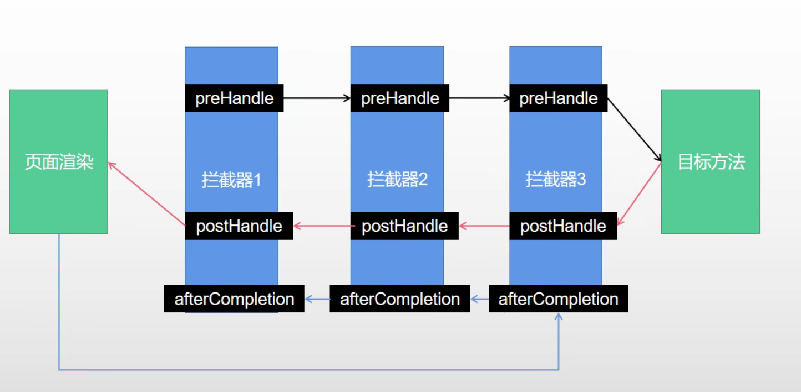

本文介绍了SpringBoot、SpringMVC等一些使用技巧。

<!--more-->

## 1. Thymeleaf速记

[Thymeleaf官方文档地址](https://www.thymeleaf.org/doc/tutorials/3.0/usingthymeleaf.html)。

Thymeleaf命名空间。
```
xmlns:th="http://www.thymeleaf.org"
```

```html
<a th:href="${link}">链接1</a>
<a th:href="@{/user}">链接1</a>
```

* 使用`$`符号包裹的变量，将访问来自Model域中的变量，当然也可以是ModelAndView。
    ```java
    @GetMapping("hello")
    public String hello(Model model) {
        model.addAttribute("link", "http://www.seekwind.xyz/");
        return "success";
    }
    ```
* 使用`@`符号包裹的变量，如果是绝对路径，则将自动加上`server.servlet.context-path`前缀。
* 使用`#`符号包裹的变量，将使用国际化。
* 双中括号`[[]]`是行内写法，用于不在标签内的值。

## 2. SpringMVC的三种视图

### 1. 普通视图

不加任何前缀，直接返回视图名称。

### 2. forward视图

页面跳转视图。格式是forward+请求名称。

```
forward:/main
```

### 3. redirect视图

重定向视图。格式是redirect+请求名称。

与forward视图的区别是，redirect视图会修改URL，而forward视图不会。

```
redirect:/main
```

## 3. 登录页面设计技巧

1. 编写控制器。在控制器中，无需写拦截逻辑。
```java
package xyz.seekwind.boot.controller;

import org.springframework.ui.Model;
import org.springframework.util.StringUtils;
import org.springframework.web.bind.annotation.GetMapping;
import org.springframework.web.bind.annotation.PostMapping;
import org.springframework.web.bind.annotation.RestController;
import xyz.seekwind.boot.bean.User;

import javax.servlet.http.HttpSession;

@Controller
public class IndexController {
    // 登录页
    @PostMapping({"/login", "/"})
    public String login(User user, HttpSession session, Model model) {
        // 登录逻辑，此处省略了数据库操作的逻辑
        if (StringUtils.hasLength(user.getUsername()) && "123456".equals(user.getPassword())) {
            session.setAttribute("loginUser", user);
            return "redirect:/main";
        }
        else {
            model.addAttribute("msg", "账号密码错误");
            return "login";
        }
    }
    // 主页
    @GetMapping("/main")
    public String main() {
        // 直接返回main视图，无需处理拦截逻辑
        return "main";
    }
}
```
1. 编写拦截器。
```java
package xyz.seekwind.boot.intercoptor;

import org.springframework.web.servlet.HandlerInterceptor;

import javax.servlet.http.HttpServletRequest;
import javax.servlet.http.HttpServletResponse;
import javax.servlet.http.HttpSession;

public class LoginInterceptor implements HandlerInterceptor {
    @Override
    public boolean preHandle(HttpServletRequest request, HttpServletResponse response, Object handler) throws Exception {
        HttpSession session = request.getSession();
        Object loginUser = session.getAttribute("loginUser");
        // 事实上，使用jsessionid与redis更好更安全，防止伪造
        if (loginUser != null) {
            return true;
        }
        session.setAttribute("msg", "请先登录");
        response.sendRedirect("/login");
        return false;
    }
}
```
3. 注册配置拦截器。
```java
package xyz.seekwind.boot.config;

import org.springframework.context.annotation.Configuration;
import org.springframework.web.servlet.config.annotation.InterceptorRegistry;
import org.springframework.web.servlet.config.annotation.WebMvcConfigurer;
import xyz.seekwind.boot.intercoptor.LoginInterceptor;

@Configuration
public class AdminWebConfig implements WebMvcConfigurer {
    @Override
    public void addInterceptors(InterceptorRegistry registry) {
        WebMvcConfigurer.super.addInterceptors(registry);
        registry.addInterceptor(new LoginInterceptor())
                .addPathPatterns("/**")
                // 防止静态资源和登录页被拦截
                .excludePathPatterns("/", "/login", "/static/**");
    }
}
```



## 4. 文件上传

下面给出单文件上传与多文件上传的案例。

```html
    <form action="/uplode" method="post" enctype="multipart/form-data">
        <div class="form-group">
            <label for="exampleFile">单文件</label>
            <input type="file" name="photo" id="exampleFile">
        </div>
        <div class="form-group">
            <label for="exampleFiles">多文件</label>
            <input type="file" name="imgs" id="exampleFiles" multiple>
        </div>
    </form>
```

```java
    @PostMapping("/upload")
    public String upload(@RequestPart("photo") MultipartFile photo,
                         @RequestPart("imgs") MultipartFile[] imgs) throws IOException {
        if (!photo.isEmpty()) {
            String name = photo.getOriginalFilename();
            photo.transferTo(new File("/path/to/" + name));
        }
        for (MultipartFile img : imgs) {
            String name = img.getOriginalFilename();
            img.transferTo(new File("/path/to/" + name));
        }
        return "main";
    }
```

## 5. 操纵数据库

### 1. MySQL

SpringBoot已经自动配置了一些资源，例如数据库连接池、数据源类型。但是以下内容仍然需要我们自己配置。

* 数据库驱动：取决于你使用的是哪种数据库。

   * 方式1：在properties中声明版本。

    ```xml
        <properties>
            <mysql.version>5.1.47</mysql.version>
        </properties>
        <dependency>
            <groupId>mysql</groupId>
            <artifactId>mysql-connector-java</artifactId>
        </dependency>
    ```

    * 方式2：在dependency中设置版本。
    
    ```xml
        <dependency>
            <groupId>mysql</groupId>
            <artifactId>mysql-connector-java</artifactId>
            <version>5.1.47</version>
        </dependency>
    ```

* 数据源配置：在其中声明url、username、password、driver-class-name等。

```yml
spring:
  datasource:
    url: jdbc:mysql://192.168.203.150:3306/crm_db?useUnicode=true&characterEncoding=utf-8&serverTimezone=Asia/Shanghai&useSSL=false
    username: root
    password: hdvbtnr$f2#@fj2
    driver-class-name: com.mysql.jdbc.Driver
```

要配置druid数据源，参照[druid github官网](https://github.com/alibaba/druid)。

* MyBatis的配置：
    * 1. 导入starter
    ```xml
        <dependency>
            <groupId>org.mybatis.spring.boot</groupId>
            <artifactId>mybatis-spring-boot-starter</artifactId>
            <version>2.2.0</version>
        </dependency>
    ```
    
    * 2. 在yml中配置：
    ```yml
    mybatis:
        mapper-locations: classpath:mapper/*.xml
        configuration:
            map-underscore-to-camel-case: true
    ```

    * 3. 书写Mapper接口
    ```java
    @Mapper
    public interface UserMapper {
        User getUserById(String id);
    }
    ```

    * 4. 编写mapper.xml。推荐下载mybatisx idea插件。
    ```xml
    <?xml version="1.0" encoding="UTF-8"?>
    <!DOCTYPE mapper PUBLIC "-//mybatis.org//DTD Mapper 3.0//EN"
            "http://mybatis.org/dtd/mybatis-3-mapper.dtd">
    <mapper namespace="xyz.seekwind.boot.mapper.UserMapper">

        <select id="getUserById" resultType="xyz.seekwind.boot.bean.User">
            select * from Users where id = #{id}
        </select>

    </mapper>
    ```
### 2. RedisTemplate、Lettuce、Jedis

