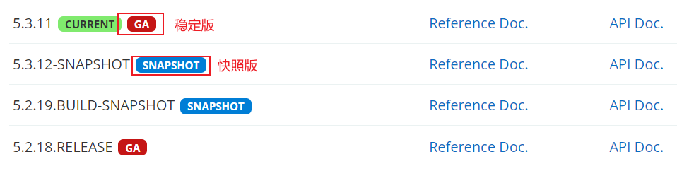
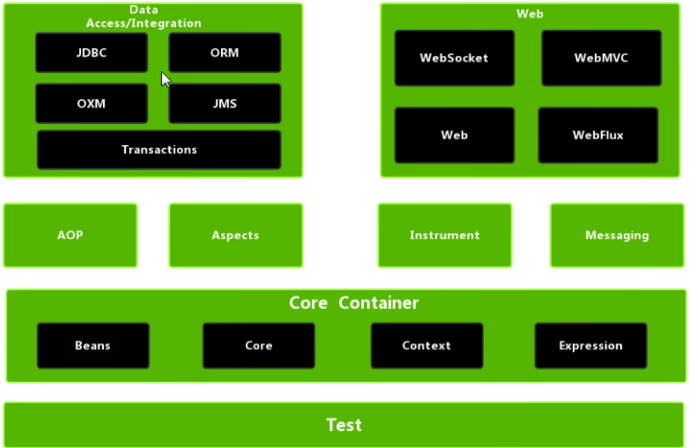

spring是轻量级的开源的JavaEE框架，它可以解决企业应用开发的复杂性。Spring有两个核心部分，IoC和AOP：

1. IoC：控制反转，把创建对象的过程交给Spring进行管理。
2. AOP：面向切面，不修改源代码进行功能增强。

Spring的特点：

1. 方便解耦，简化开发。IoC。
2. AOP编程支持。
3. 方便程序的测试。
4. 方便集成各种优秀的框架。
5. 方便进行事务操作。
6. 降低API的开发难度。

