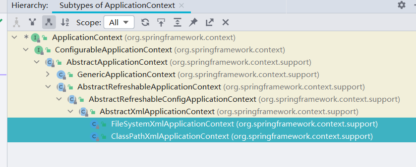
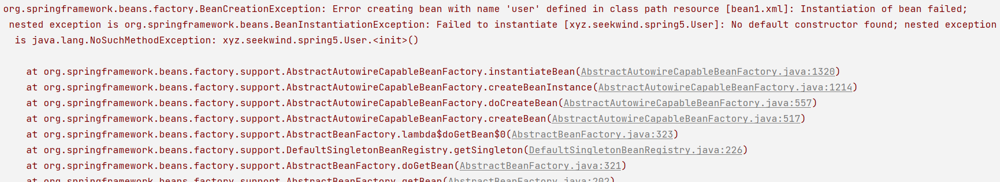
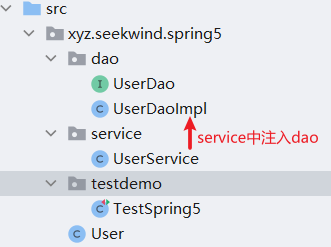
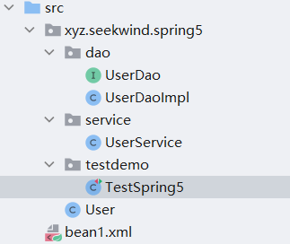
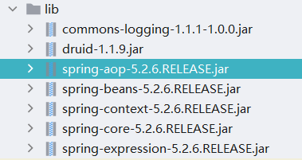

**控制反转**（Inversion of Control，缩写为**IoC**），是**面向对象编程**中的一种设计原则，可以用来减低计算机**代码**之间的耦合度。

<!--more-->

其中最常见的方式叫做**依赖注入**（Dependency Injection，简称**DI**），还有一种方式叫“依赖查找”（Dependency Lookup）。通过控制反转，对象在被创建的时候，由一个调控系统内所有对象的外界实体将其所依赖的对象的引用传递给它。也可以说，依赖被注入到对象中。

在传统的面向对象编程中，对象都是通过程序员手动new的方式创建，并且由程序员对对象进行管理。Spring使用IoC容器代替程序员管理对象，包括：

- 创建对象：懒加载（BeanFactory）或者启动时立马加载（ApplicationContext）。
- 依赖注入：对IoC容器调用getBean()方法时，IoC容器会返回一个装配完毕的对象。当然，使用@Autowired、@Qualifier、@Resource注解可以完成依赖的自动注入。
- 生命周期管理：可以在XML配置文件中指定Bean的scope属性，来让IoC控制Bean的作用域与生命周期，例如是否是单例的、是否只对当前Session有效。

## 1. 底层原理

xml解析、工厂模式、反射。

```xml
<?xml version="1.0" encoding="UTF-8"?>
<beans xmlns="http://www.springframework.org/schema/beans"
       xmlns:xsi="http://www.w3.org/2001/XMLSchema-instance"
       xsi:schemaLocation=
       "http://www.springframework.org/schema/beans
       http://www.springframework.org/schema/beans/spring-beans.xsd">
    <!--Config User Class instance-->
    <bean id="user" class="xyz.seekwind.spring5.User"></bean>
</beans>
```

```java
public UserFactory {
    public User getUser() {
        // xml解析，使用类似dom4j等框架
        String className = xml解析出class属性即全限类名;
        // 通过反射创建对象
        Class clazz = Class.forName(className);
        return (User)clazz.newInstance();
    }
}
```

## 2. 两个重要的接口

1. BeanFactory：IoC容器基本实现，是Spring内部使用的接口，一般不提供开发人员使用。加载配置文件时，不会创建对象，在获取或使用对象（即getBean时创建对象）才去创建对象。
2. ApplicationContext：BeanFactory接口的子接口，提供更多强大的功能，一般由开发人员使用。加载配置文件时即创建对象，也就是在第一行代码就创建对象。同时，它继承自ResourceLoader，能够加载来自其他来源的资源，例如来自网络的资源。

```java
public class TestSpring5 {

    @Test
    public void testAdd() {
        // 1. Load the Spring Configuration
        // 此处完全可以使用BeanFactory
        // xml under the class path
        ApplicationContext context = new ClassPathXmlApplicationContext("bean1.xml"); 
        // 2. get the instance
        User user = context.getBean("user", User.class);
        System.out.println(user);
        user.add();
    }
}
```

`ClassPathXmlApplicationContext`是使用classpath路径作为基础路径，指定xml文件的位置。还有一个与之并列的实现类`FileSystermXmlApplicationContext`是使用操作系统的绝对路径定位xml的。



## 3. Bean管理

Bean管理，即**创建对象**和**注入属性**。

有两种方式：基于xml配置文件，基于注解。

首先介绍基于xml方式创建对象。

### 1. xml方式

id属性：bean的唯一标识符。取代name使用。

class属性：类全路径，包类路径，全限类名。

```xml
<?xml version="1.0" encoding="UTF-8"?>
<beans xmlns="http://www.springframework.org/schema/beans"
       xmlns:xsi="http://www.w3.org/2001/XMLSchema-instance"
       xsi:schemaLocation=
       "http://www.springframework.org/schema/beans 
        http://www.springframework.org/schema/beans/spring-beans.xsd">
    <!--Config User Class instance-->
    <bean id="user" class="xyz.seekwind.spring5.User"></bean>
</beans>
```

创建对象的时候，默认使用**无参构造方法**，因此如果没有无参构造方法，将会出现以下错误。

```java
package xyz.seekwind.spring5;

public class User {
    String name;

    // 声明有参构造器后，不会自动生成无参构造器
    public User(String name) {
        this.name = name;
    }

    public void add() {
        System.out.println("add...");

    }
}
```



#### 1. set注入

注入属性的方式之一是DI依赖注入，也就是注入属性。可以使用set方法注入，也可以通过有参构造器注入。

```java
package xyz.seekwind.spring5.testdemo;

import org.junit.Test;
import org.springframework.context.ApplicationContext;
import org.springframework.context.support.ClassPathXmlApplicationContext;
import xyz.seekwind.spring5.User;

public class TestSpring5 {

    @Test
    public void testAdd() {
        // 1. Load the Spring Configuration
        // xml under the class path
        ApplicationContext context = new ClassPathXmlApplicationContext("bean1.xml"); 
        // 2. get the instance
        User user = context.getBean("user", User.class);
        System.out.println(user);
    }
}
```

```java
package xyz.seekwind.spring5;

public class User {
    String username;
    String password;

    public void setUsername(String username) {
        this.username = username;
    }

    public void setPassword(String password) {
        this.password = password;
    }

    @Override
    public String toString() {
        return "User{" +
                "username='" + username + '\'' +
                ", password='" + password + '\'' +
                '}';
    }
}
```

```xml
<?xml version="1.0" encoding="UTF-8"?>
<beans xmlns="http://www.springframework.org/schema/beans"
       xmlns:xsi="http://www.w3.org/2001/XMLSchema-instance"
       xsi:schemaLocation=
       "http://www.springframework.org/schema/beans 
       http://www.springframework.org/schema/beans/spring-beans.xsd">
    <!--Config User Class instance-->
    <bean id="user" class="xyz.seekwind.spring5.User">
        <!--   name:即成员变量的属性名     -->
        <!--   value:即成员变量的属性值    -->
        <property name="username" value="seekwind"></property>
        <property name="password" value="12345678"></property>
    </bean>
</beans>
```

#### 2. 构造器注入

也可以使用有参数构造器构造。将上述的User类和xml作如下修改。

```java
package xyz.seekwind.spring5;

public class User {
    String username;
    String password;

    public User(String username, String password) {
        this.username = username;
        this.password = password;
    }

    @Override
    public String toString() {
        return "User{" +
                "username='" + username + '\'' +
                ", password='" + password + '\'' +
                '}';
    }
}
```

```xml
<?xml version="1.0" encoding="UTF-8"?>
<beans xmlns="http://www.springframework.org/schema/beans"
       xmlns:xsi="http://www.w3.org/2001/XMLSchema-instance"
       xsi:schemaLocation=
       "http://www.springframework.org/schema/beans 
       http://www.springframework.org/schema/beans/spring-beans.xsd">
    <!--Config User Class instance-->
    <bean id="user" class="xyz.seekwind.spring5.User">
        <constructor-arg name="username" value="seekwind"></constructor-arg>
        <constructor-arg name="password" value="12345678"></constructor-arg>
    </bean>
</beans>
```

xml中的constructor-arg参数中的name属性可以使用index熟悉取代，但不建议。

```xml
<constructor-arg index="0" value="seekwind"></constructor-arg>
<constructor-arg index="1" value="12345678"></constructor-arg>
```

#### 3. p名称空间注入

事实上，**基于set**的注入还可以使用p名称空间注入。但是需要记住在根标签中添加`xmlns:p="http://www.springframework.org/schema/p"`的属性。工作中用的不多。

```xml
<?xml version="1.0" encoding="UTF-8"?>
<beans xmlns="http://www.springframework.org/schema/beans"
       xmlns:xsi="http://www.w3.org/2001/XMLSchema-instance"
       xmlns:p="http://www.springframework.org/schema/p"
       xsi:schemaLocation=
       "http://www.springframework.org/schema/beans 
       http://www.springframework.org/schema/beans/spring-beans.xsd">
    <!--Config User Class instance-->
    <bean 
        id="user" 
        class="xyz.seekwind.spring5.User" 
        p:username="seekwind" 
        p:password="12345678">
    </bean>
</beans>
```

#### 4. 注入空值和特殊符号

```xml
<?xml version="1.0" encoding="UTF-8"?>
<beans xmlns="http://www.springframework.org/schema/beans"
       xmlns:xsi="http://www.w3.org/2001/XMLSchema-instance"
       xsi:schemaLocation=
       "http://www.springframework.org/schema/beans 
       http://www.springframework.org/schema/beans/spring-beans.xsd">
    <!--Config User Class instance-->
    <bean id="user" class="xyz.seekwind.spring5.User">
        <!--注入空值null-->
        <property name="username"><null></null></property>
        <!--含有特殊符号的value<<1234>>，可以通过转义字符-->
        <property name="password" value="<<1234>>"></property>
    </bean>
</beans>
```

含有特殊符号的value也可以使用CDATA语法。

```xml
<property name="password">
    <value><![CDATA[<<1234>>]]></value>
</property>
```

#### 5. 注入外部Bean



```xml
<?xml version="1.0" encoding="UTF-8"?>
<beans xmlns="http://www.springframework.org/schema/beans"
       xmlns:xsi="http://www.w3.org/2001/XMLSchema-instance"
       xsi:schemaLocation=
       "http://www.springframework.org/schema/beans 
       http://www.springframework.org/schema/beans/spring-beans.xsd">
    <!--即使userDao中含有属性值，也会被级联赋值到userService中-->
    <bean id="userDao" class="xyz.seekwind.spring5.dao.UserDaoImpl"></bean>
    <bean id="userService" class="xyz.seekwind.spring5.service.UserService">
        <!--ref属性指向外部bean的id-->
        <property name="userDao" ref="userDao"></property>
    </bean>
</beans>
```

```java
package xyz.seekwind.spring5.service;

import xyz.seekwind.spring5.dao.UserDao;

public class UserService {
    // 需要注入的userDao
    private UserDao userDao;
    // set注入
    public void setUserDao(UserDao userDao) {
        this.userDao = userDao;
    }

    public void update() {
        userDao.update();
    }
}
```

#### 6. 注入内部bean

如果不希望使用外部bean，则可以如下修改xml配置文件，可以达到一样的效果。

```xml
<?xml version="1.0" encoding="UTF-8"?>
<beans xmlns="http://www.springframework.org/schema/beans"
       xmlns:xsi="http://www.w3.org/2001/XMLSchema-instance"
       xsi:schemaLocation=
       "http://www.springframework.org/schema/beans 
       http://www.springframework.org/schema/beans/spring-beans.xsd">
    <bean id="userService" class="xyz.seekwind.spring5.service.UserService">
        <property name="userDao">
            <!--内部bean-->
            <bean id="userDao" class="xyz.seekwind.spring5.dao.UserDaoImpl"></bean>
        </property>
    </bean>
</beans>
```

#### 7. 级联赋值

除了在外部bean中进行级联赋值外，还可以在自己的bean中对外部bean的实例进行赋值。



```xml
<?xml version="1.0" encoding="UTF-8"?>
<beans xmlns="http://www.springframework.org/schema/beans"
       xmlns:xsi="http://www.w3.org/2001/XMLSchema-instance"
       xsi:schemaLocation=
       "http://www.springframework.org/schema/beans 
       http://www.springframework.org/schema/beans/spring-beans.xsd">
    <bean id="userDao" class="xyz.seekwind.spring5.dao.UserDaoImpl">
        <property name="userDaoName" value="myDao1"></property>
    </bean>
    <bean id="userService" class="xyz.seekwind.spring5.service.UserService">
        <!--ref属性指向外部bean的id-->
        <property name="userDao" ref="userDao"></property>
        <!--此处是将上面的userDaoName属性值修改为myDao2，并不是新建了一个dao-->
        <!--即默认情况下，每个bean是单例的-->
        <property name="userDao.userDaoName" value="myDao2"></property>
    </bean>
</beans>
```

```java
package xyz.seekwind.spring5.dao;

public interface UserDao {
    String userDaoName = null;

    void update();

    void setUserDaoName(String userDaoName);
    String getUserDaoName();

}
```

```java
package xyz.seekwind.spring5.dao;

public class UserDaoImpl implements UserDao {
    String userDaoName = null;

    public void setUserDaoName(String userDaoName) {
        this.userDaoName = userDaoName;
    }

    @Override
    public String getUserDaoName() {
        return userDaoName;
    }

    @Override
    public void update() {
        System.out.println("userDaoImpl update");
    }
}
```

```java
package xyz.seekwind.spring5.service;

import xyz.seekwind.spring5.dao.UserDao;

public class UserService {
    private UserDao userDao;

    public void setUserDao(UserDao userDao) {
        this.userDao = userDao;
    }

    // get方法十分关键，否则在xml中无法取得userDao.userDaoName
    public UserDao getUserDao() {
        return userDao;
    }

    public void update() {
        userDao.update();
    }
}
```

```java
package xyz.seekwind.spring5.testdemo;

import org.junit.Test;
import org.springframework.context.ApplicationContext;
import org.springframework.context.support.ClassPathXmlApplicationContext;
import xyz.seekwind.spring5.dao.UserDao;
import xyz.seekwind.spring5.service.UserService;

public class TestSpring5 {

    @Test
    public void testAdd() {
        // 1. Load the Spring Configuration
        ApplicationContext context = new ClassPathXmlApplicationContext("bean1.xml"); 
        // 2. get the instance
        UserService userService = context.getBean("userService", UserService.class);
        userService.update();
        // 输出myDao2
        System.out.println(userService.getUserDao().getUserDaoName());

        UserDao userDao = context.getBean("userDao", UserDao.class);
        // 也输出myDao2，即说明两者是单例的
        System.out.println(userDao.getUserDaoName());
    }
}
```

#### 8. 注入集合类型属性

在Student类中添加多个集合字段。

```java
package xyz.seekwind.spring5_2;

import java.util.Arrays;
import java.util.List;
import java.util.Map;
import java.util.Set;

public class Student {
    private String[] courses;
    private List<String> list;
    private Map<String, String> map;
    private Set<String> set;

    public void setCourses(String[] courses) {
        this.courses = courses;
    }

    public void setList(List<String> list) {
        this.list = list;
    }

    public void setMap(Map<String, String> map) {
        this.map = map;
    }

    public void setSet(Set<String> set) {
        this.set = set;
    }

    @Override
    public String toString() {
        return "Student{" +
                "courses=" + Arrays.toString(courses) +
                ", list=" + list +
                ", map=" + map +
                ", set=" + set +
                '}';
    }
}
```

下面将在xml中注入，集合类型属性。可以看到：

| 集合类型 | property下的一级父标签 | 子标签 |
| --- | --- | --- |
| 数组  | array或list | value或ref |
| 列表  | list | value或ref |
| 集合  | set | value或ref |
| 键值对 | map | entry |

```xml
<?xml version="1.0" encoding="UTF-8"?>
<beans xmlns="http://www.springframework.org/schema/beans"
       xmlns:xsi="http://www.w3.org/2001/XMLSchema-instance"
       xsi:schemaLocation=
       "http://www.springframework.org/schema/beans 
       http://www.springframework.org/schema/beans/spring-beans.xsd">

    <bean id="student" class="xyz.seekwind.spring5_2.Student">

        <property name="courses">
            <array>
                <value>JavaSE</value>
                <value>JVM</value>
                <value>JUC</value>
            </array>
        </property>

        <property name="list">
            <list>
                <value>SeekWind</value>
                <value>Keven</value>
            </list>
        </property>

        <property name="map">
            <map>
                <entry key="JAVA" value="java"></entry>
                <entry key="PYTHON" value="python"></entry>
                <entry key="CPP" value="cpp"></entry>
            </map>
        </property>

        <property name="set">
            <set>
                <value>MySQL</value>
                <value>Redis</value>
            </set>
        </property>

    </bean>
</beans>
```

使用ref标签是为了满足如`List<Cource>`此类以普通对象作为集合元素的情况。使用如下。

```xml
    <bean id="student" class="xyz.seekwind.spring5_2.Student">

        <property name="list">
            <list>
                <ref bean="bean_id"></ref>
            </list>
        </property>

    </bean>

    <bean id="bean_id" class="xyz.seekwind.spring5_2.Course"></bean>
```

根据上面的案例，我们可以发现array、list、map、set都被写成了内部集合的形式。为了更好的降低耦合度，我们可以将其启动到bean外部，但是需要借助util命名空间。

```xml
<?xml version="1.0" encoding="UTF-8"?>
<beans xmlns="http://www.springframework.org/schema/beans"
       xmlns:xsi="http://www.w3.org/2001/XMLSchema-instance"
       xmlns:util="http://www.springframework.org/schema/util"
       xsi:schemaLocation=
       "http://www.springframework.org/schema/beans 
       http://www.springframework.org/schema/beans/spring-beans.xsd
       http://www.springframework.org/schema/util 
       http://www.springframework.org/schema/util/spring-util.xsd">

    <bean id="student" class="xyz.seekwind.spring5_2.Student">
        <property name="list" ref="studentList"></property>
    </bean>

    <util:list id="studentList">
        <value>SeekWind</value>
        <value>Keven</value>
    </util:list>
</beans>
```

#### 9. FactoryBean

Bean有两种，普通bean和工厂bean。

- 普通bean：在配置文件中定义的bean类型和返回类型一样。
- 工厂bean：在配置文件中定义的bean类型可以和返回的不一样。

```xml
<?xml version="1.0" encoding="UTF-8"?>
<beans xmlns="http://www.springframework.org/schema/beans"
       xmlns:xsi="http://www.w3.org/2001/XMLSchema-instance"
       xsi:schemaLocation=
       "http://www.springframework.org/schema/beans 
       http://www.springframework.org/schema/beans/spring-beans.xsd">

    <bean id="myBean" class="xyz.seekwind.spring5_3.MyBean">

    </bean>
</beans>
```

```java
package xyz.seekwind.spring5_3;

public class Course {
    private String name;

    public String getName() {
        return name;
    }

    public void setName(String name) {
        this.name = name;
    }

    @Override
    public String toString() {
        return "Course{" +
                "name='" + name + '\'' +
                '}';
    }
}
```

```java
package xyz.seekwind.spring5_3;

import org.springframework.beans.factory.FactoryBean;

public class MyBean implements FactoryBean<Course> {
    @Override
    public Course getObject() throws Exception {
        // 在这里进行预处理
        Course course = new Course();
        course.setName("Java");
        return course;
    }

    @Override
    public Class<?> getObjectType() {
        return null;
    }

    @Override
    public boolean isSingleton() {
        return FactoryBean.super.isSingleton();
    }
}
```

```java
package xyz.seekwind.spring5_3;

import org.junit.Test;
import org.springframework.context.ApplicationContext;
import org.springframework.context.support.ClassPathXmlApplicationContext;

public class TestUnit {
    @Test
    public void test() {
        ApplicationContext context = new ClassPathXmlApplicationContext("bean3.xml");
        Course course = context.getBean("myBean", Course.class);
        System.out.println(course);
    }
}
```

#### 10. Bean的作用域

默认情况下，Spring的Bean是单例对象。在bean标签中，使用scope属性可以设置其为单例还是多例。

```xml
<?xml version="1.0" encoding="UTF-8"?>
<beans xmlns="http://www.springframework.org/schema/beans"
       xmlns:xsi="http://www.w3.org/2001/XMLSchema-instance"
       xsi:schemaLocation=
       "http://www.springframework.org/schema/beans 
       http://www.springframework.org/schema/beans/spring-beans.xsd">
    <!--单例-->
    <bean id="myBean" class="xyz.seekwind.spring5_3.MyBean" scope="singleton">
    </bean>
    <!--多例-->
    <bean id="myBean2" class="xyz.seekwind.spring5_3.MyBean" scope="prototype">
    </bean>
</beans>
```

singleton是单例，prototype是多例。

- singleton单例时，会在加载配置文件ApplicationContext时创建单例对象。
- prototype多例时，会在getBean时创建对象。
- session会针对每个session创建一个Bean。
- request会为每个请求创建一个Bean。

#### 11. Bean的生命周期

在创建Bean之前，Spring IoC需要经历以下步骤：

1. 加载XML配置文件，将XML中关于每个Bean的声明内容转化为一个BeanDefinition对象，对象中包括Class、域的值等内容。BeanDefination由BeanDefinitionRegistry管理。
2. 在需要创建Bean时，根据BeanDefination中关于对象的信息，创建出满足要求的对象。

从bean创建到销毁的过程。

1. 通过构造器**创建**bean实例，使用何种方式创建已经在前文中介绍。
2. 为bean**注入**属性值和对其他bean的引用（调用set方法）。
3. 把bean实例传递给bean**后置处理器**的方法`postProcessBeforeInitialization`。
4. 调用bean的初始化方法，需要进行单独配置。
5. 把bean实例传递给bean**后置处理器**的方法`postProcessAfterInitialization`。
6. bean可以使用了，**对象获取到了**。
7. 当容器关闭时，调用bean**销毁**的方法，需要进行单独配置。

初始化方法与销毁方法需要在xml中进行声明，方法写在bean类里。

```xml
<bean id="myBean2" 
      class="xyz.seekwind.spring5_3.MyBean" 
      init-method="myInitMathod" 
      destroy-method="myDestoryMethod">
</bean>
```

可以通过如下方法让bean实例手动销毁。

```java
package xyz.seekwind.spring5_3;

import org.junit.Test;
import org.springframework.context.ApplicationContext;
import org.springframework.context.support.ClassPathXmlApplicationContext;

public class TestUnit {
    @Test
    public void test() {
        ApplicationContext context = new ClassPathXmlApplicationContext("bean3.xml");
        MyBean myBean = context.getBean("myBean", MyBean.class);
        // 此处需要进行强制转换，因为close方法来源于子类
        ((ClassPathXmlApplicationContext) context).close();
    }
}
```

给bean配置默认后置处理器。

```java
package xyz.seekwind.spring5_3;

import org.springframework.beans.BeansException;
import org.springframework.beans.factory.config.BeanPostProcessor;

public class MyBeanPost implements BeanPostProcessor {
    @Override
    public Object postProcessBeforeInitialization(Object bean, String beanName) 
            throws BeansException {
        return BeanPostProcessor.super.postProcessBeforeInitialization(bean, beanName);
    }

    @Override
    public Object postProcessAfterInitialization(Object bean, String beanName) 
            throws BeansException {
        return BeanPostProcessor.super.postProcessAfterInitialization(bean, beanName);
    }
}
```

```xml
<?xml version="1.0" encoding="UTF-8"?>
<beans xmlns="http://www.springframework.org/schema/beans"
       xmlns:xsi="http://www.w3.org/2001/XMLSchema-instance"
       xsi:schemaLocation=
       "http://www.springframework.org/schema/beans 
       http://www.springframework.org/schema/beans/spring-beans.xsd">

    <bean id="myBean" class="xyz.seekwind.spring5_3.MyBean">
    </bean>
    <!--此处的bean后置处理器对整个xml文档生效-->
    <bean id="myBeanPost" class="xyz.seekwind.spring5_3.MyBeanPost"></bean>
</beans>
```

#### 12. XML自动注入

```xml
<?xml version="1.0" encoding="UTF-8"?>
<beans xmlns="http://www.springframework.org/schema/beans"
       xmlns:xsi="http://www.w3.org/2001/XMLSchema-instance"
       xmlns:util="http://www.springframework.org/schema/util"
       xsi:schemaLocation=
       "http://www.springframework.org/schema/beans 
        http://www.springframework.org/schema/beans/spring-beans.xsd
        http://www.springframework.org/schema/util 
        http://www.springframework.org/schema/util/spring-util.xsd">

    <!--通过name与id的对应关系自动注入-->
    <bean id="student" class="xyz.seekwind.spring5_2.Student" autowire="byName">
<!--        <property name="list" ref="list"></property>-->
    </bean>

    <util:list id="list">
        <value>SeekWind</value>
        <value>Keven</value>
    </util:list>
</beans>
```

autowire属性还有`byType`的值类型，是根据类型进行注入。

#### 13. 使用外部属性文件

```properties
# jdbc.properties
jdbc.dataSource=com.alibaba.druid.pool.DruidDataSource
jdbc.driverClass=com.mysql.jdbc.Driver
jdbc.url=mysql://192.168.203.101:3306/userDB
jdbc.username=root
jdbc.password=123456
```

需要注意的是，xml中需要添加context名称空间。

```xml
<?xml version="1.0" encoding="UTF-8"?>
<beans xmlns="http://www.springframework.org/schema/beans"
       xmlns:context="http://www.springframework.org/schema/context"
       xmlns:xsi="http://www.w3.org/2001/XMLSchema-instance"
       xsi:schemaLocation=
       "http://www.springframework.org/schema/beans 
        http://www.springframework.org/schema/beans/spring-beans.xsd
        http://www.springframework.org/schema/context 
        http://www.springframework.org/schema/context/spring-context.xsd">

    <!--路径是相对于classpath的-->
    <context:property-placeholder l
        ocation="classpath:jdbc.properties">
    </context:property-placeholder>

    <bean id="dataSource" class="${jdbc.dataSource}">
        <property name="driverClassName" value="${jdbc.driverClass}"></property>
        <property name="url" value="${jdbc.url}"></property>
        <property name="username" value="${jdbc.username}"></property>
        <property name="password" value="${jdbc.password}"></property>
    </bean>
</beans>
```

### 2. Annotation方式

目的：简化xml配置。

Spring针对管理Bean提供了四个类注解：

- `@Component`：普通的组件
- `@Service`：用于业务逻辑层、Service层
- `@Controller`：用于Web层
- `@Reposity`：用于DAO层、持久层

本质上，这四个注解的功能是完全一样的，都可以用来创建Bean实例，但是推荐按照其语义在恰当的地方使用。

使用Annotation进行Bean创建需要引入`spring-aop-5.2.6.RELEASE.jar`。



在xml中引入context命名空间，开启自动配置。

```xml
<?xml version="1.0" encoding="UTF-8"?>
<beans xmlns="http://www.springframework.org/schema/beans"
       xmlns:context="http://www.springframework.org/schema/context"
       xmlns:xsi="http://www.w3.org/2001/XMLSchema-instance"
       xsi:schemaLocation=
       "http://www.springframework.org/schema/beans 
        http://www.springframework.org/schema/beans/spring-beans.xsd
        http://www.springframework.org/schema/context 
        http://www.springframework.org/schema/context/spring-context.xsd">
    <!--开启自动扫描。如果有多个package需要扫描，则用逗号隔开包名，或者写它们的公共父目录-->
    <context:component-scan 
        base-package="xyz.seekwind.spring5_4">
    </context:component-scan>

</beans>
```

给Bean添加Service注解，当然，上述四个注解中任意一个都是可以的。

```java
package xyz.seekwind.spring5_4;

import org.springframework.stereotype.Service;

// 相当于是<bean id="userService" class="xyz.seekwind.spring5_4.UserService"/>
// 可以不写value，默认是类名，首字母小写
@Service(value = "userService")
public class UserService {

    public void add() {
        System.out.println("Service add");
    }
}
```

```java
package xyz.seekwind.spring5_4;

import org.junit.Test;
import org.springframework.context.ApplicationContext;
import org.springframework.context.support.ClassPathXmlApplicationContext;

public class TestUnit {

    // public一定要写
    @Test
    public void testService() {
        ApplicationContext context = new ClassPathXmlApplicationContext("bean4.xml");
        UserService userService = context.getBean("userService", UserService.class);
        System.out.println(userService);
        userService.add();
    }
}
```

#### 1. 组件扫描配置

可以为自动扫描添加过滤器。

```xml
<?xml version="1.0" encoding="UTF-8"?>
<beans xmlns="http://www.springframework.org/schema/beans"
       xmlns:context="http://www.springframework.org/schema/context"
       xmlns:xsi="http://www.w3.org/2001/XMLSchema-instance"
       xsi:schemaLocation=
       "http://www.springframework.org/schema/beans 
        http://www.springframework.org/schema/beans/spring-beans.xsd
        http://www.springframework.org/schema/context 
        http://www.springframework.org/schema/context/spring-context.xsd">

    <!--不使用默认过滤器-->
    <context:component-scan 
        base-package="xyz.seekwind.spring5_4" 
        use-default-filters="false">
        <!--除了Controller都扫描-->
        <context:exclude-filter 
            type="annotation" 
            expression="org.springframework.stereotype.Controller"/>
        <!--只扫描Service-->
        <!--<context:include-filter 
            type="annotation" 
            expression="org.springframework.stereotype.Service"/>-->
    </context:component-scan>

</beans>
```

#### 2. 属性注入

- `@Autowire`：根据**属性类型**进行自动装配。
- `@Qualifier`：根据**id**进行注入，配合Autowire使用。
- `@Resource`：可以根据**属性类型**注入，也可以根据**名称**注入。来自于javax包，不推荐使用。
- `@Value`：以上三者是给对象注入的，而该注解可以注入**基本数据类型**、**String**等普通类型。

下面是一个Autowire的例子

```java
package xyz.seekwind.spring5_4.dao;

// 这里不加Reposity注解嗷，接口不能实例化
public interface UserDao {
    public void add();
}
```

```java
package xyz.seekwind.spring5_4.dao;

import org.springframework.stereotype.Repository;

@Repository
public class UserDaoImpl implements UserDao {

    @Override
    public void add() {
        System.out.println("dao add");
    }
}
```

```java
package xyz.seekwind.spring5_4;

import org.springframework.beans.factory.annotation.Autowired;
import org.springframework.stereotype.Service;
import xyz.seekwind.spring5_4.dao.UserDao;

@Service
public class UserService {
    // 不需要写set方法
    // Autowired是根据类型进行注入的
    // 会自动找到生成的bean中，有一个bean是userDaoImpl，然后注入进去
    @Autowired
    private UserDao userDao;
    public void add() {
        System.out.println("Service add");
        userDao.add();
    }
}
```

```java
package xyz.seekwind.spring5_4;

import org.junit.Test;
import org.springframework.context.ApplicationContext;
import org.springframework.context.support.ClassPathXmlApplicationContext;

public class TestUnit {

    // public一定要写
    @Test
    public void testService() {
        ApplicationContext context = new ClassPathXmlApplicationContext("bean4.xml");
        UserService userService = context.getBean("userService", UserService.class);
        System.out.println(userService);
        userService.add();
    }
}
```

上面提到的userDao是单例的，因为它只有userDaoImpl一个实现类。如果它不是单例的，或者有**多个实现类**，那么仅仅使用Autowire是不能确定具体需要将哪个userDao注入的，因为它只能通过类型注入。这时候就需要使用Qualifier来通过id注入了。

这样就可以完成按指定名称注入了。一定要注意的是，Qualifier必须和Autowire一起使用，因为Qualifier只是一个**鉴别器**或者**过滤器**，Autowire才是注入对象的提供者。

```java
package xyz.seekwind.spring5_4.dao;

import org.springframework.stereotype.Repository;

// 此处将id值声明为userDaoImpl1
@Repository(value = "userDaoImpl1")
public class UserDaoImpl implements UserDao {

    @Override
    public void add() {
        System.out.println("dao1 add");
    }
}
```

```java
package xyz.seekwind.spring5_4;

import org.springframework.beans.factory.annotation.Autowired;
import org.springframework.beans.factory.annotation.Qualifier;
import org.springframework.stereotype.Service;
import xyz.seekwind.spring5_4.dao.UserDao;

@Service
public class UserService {
    // Qualifier注解的值需要与所希望注入的bean的id一致
    @Autowired
    @Qualifier("userDaoImpl1")
    private UserDao userDao;
    public void add() {
        System.out.println("Service add");
        userDao.add();
    }
}
```

Resource注解相当于Autowire和Qualifier的结合版，但不推荐使用。

```java
package xyz.seekwind.spring5_4;

import org.springframework.beans.factory.annotation.Autowired;
import org.springframework.beans.factory.annotation.Qualifier;
import org.springframework.stereotype.Service;
import xyz.seekwind.spring5_4.dao.UserDao;

import javax.annotation.Resource;


@Service
public class UserService {
    // 相当于Autowire和Qualifier的结合版
    // 来自于javax包，因此spring不建议使用这个注解
    // 该注解以于JDK11移除
    @Resource(name = "userDaoImpl1")
    private UserDao userDao;
    public void add() {
        System.out.println("Service add");
        userDao.add();
    }
}
```

Value注入普通类型，例如字符串。

```java
package xyz.seekwind.spring5_4;

import org.springframework.beans.factory.annotation.Value;


@Service
public class UserService {
    // 方便后续在value中使用表达式
    @Value("abc")
    private String name;

}
```

#### 3. 纯注解开发

创建配置类，完全取代xml。

```java
package xyz.seekwind.spring5_4.config;

import org.springframework.context.annotation.ComponentScan;
import org.springframework.context.annotation.Configuration;

@Configuration // 表示这是个配置类
@ComponentScan(basePackages = "xyz.seekwind.spring5_4") // 设置扫描bean的路径
public class SeekWindConfig {

}
```

```java
package xyz.seekwind.spring5_4;

import org.junit.Test;
import org.springframework.context.ApplicationContext;
import org.springframework.context.annotation.AnnotationConfigApplicationContext;
import xyz.seekwind.spring5_4.config.SeekWindConfig;
import xyz.seekwind.spring5_4.service.UserService;

public class TestUnit {

    @Test
    public void testService() {
        // 修改为配置类的Context实现类
        ApplicationContext context 
            = new AnnotationConfigApplicationContext(SeekWindConfig.class);
        UserService userService = context.getBean("userService", UserService.class);
        System.out.println(userService);
        userService.add();
        System.out.println(userService.getName());
    }
}
```