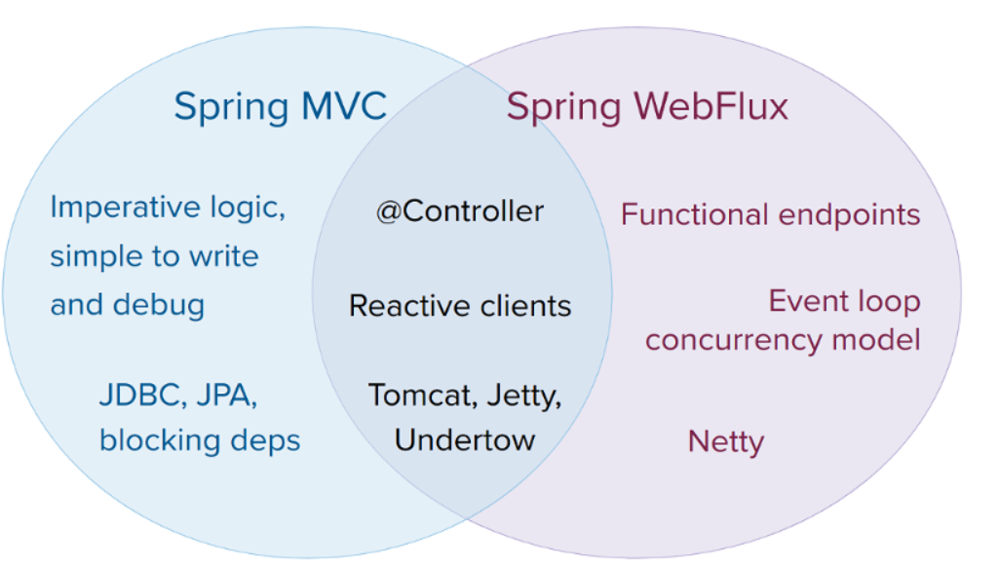

整合Log4j、JUnit5等。
<!--more-->

## 1. Spring5整合日志框架

Spring5已经移除了Log4j，官方建议使用Log4j2。

### 1. 引入新的依赖

```xml
        <!-- https://mvnrepository.com/artifact/org.apache.logging.log4j/log4j-api -->
        <dependency>
            <groupId>org.apache.logging.log4j</groupId>
            <artifactId>log4j-api</artifactId>
            <version>2.11.2</version>
        </dependency>
        <!-- https://mvnrepository.com/artifact/org.apache.logging.log4j/log4j-core -->
        <dependency>
            <groupId>org.apache.logging.log4j</groupId>
            <artifactId>log4j-core</artifactId>
            <version>2.11.2</version>
        </dependency>
        <!-- https://mvnrepository.com/artifact/org.apache.logging.log4j/log4j-slf4j-impl -->
        <dependency>
            <groupId>org.apache.logging.log4j</groupId>
            <artifactId>log4j-slf4j-impl</artifactId>
            <version>2.11.2</version>
            <scope>test</scope>
        </dependency>
        <!-- https://mvnrepository.com/artifact/org.slf4j/slf4j-api -->
        <dependency>
            <groupId>org.slf4j</groupId>
            <artifactId>slf4j-api</artifactId>
            <version>1.7.30</version>
        </dependency>
```

### 2. 创建log4j2.xml配置文件

注意，配置文件名字是固定的，不能随意修改。

```xml
<?xml version="1.0" encoding="UTF-8"?>
<!--日志级别 OFF > FATAL > ERROR > WARN > INFO > DEBUG > TRACE > ALL-->
<!--显示日志的级别大于等于设置的日志级别-->
<configuration status="ALL">
    <appenders>
        <console name="Console" target="SYSTEM_OUT">
            <patternLayout pattern="%d{yyyy-MM-dd HH:mm:ss.SSS} [%t] %-5level %logger{36} - %msg%n"/>
        </console>
    </appenders>
    <loggers>
        <root level="error">
            <appenderRef ref="Console"/>
        </root>
    </loggers>
</configuration>
```

### 3. 在java程序中输出log

```java
private static final Logger log = LoggerFactory.getLogger(Application.class);
// 如下调用
log.info("Hello");
```

## 2. Spring5核心容器支持@Nullable注解

```java
@Nullable // 注解用在方法上，代表方法返回值可以为空
String getId();

public void method(@Nullable String name); // 注解用在形参上，代表参数可以为空

@Nullable // 注解用在属性上面，代表属性可以为空
String name;
```

## 3. 支持函数式风格Lambda表达式

```java
    @Test
    public void test() {
        // 创建GenericApplicationContext对象
        GenericApplicationContext context = new GenericApplicationContext();
        // 在IoC容器中注册新Bean
        context.refresh();
        context.registerBean(Book.class, () -> new Book());
        // 获取Bean
        Book book = (Book) context.getBean("xyz.seekwind.Spring5_jdbc.entity.Book");
        System.out.println(book);
    }
```

```java
    @Test
    public void test() {
        GenericApplicationContext context = new GenericApplicationContext();
        context.refresh();
        // 也可以在注册时为bean声明名称
        context.registerBean("user1",Book.class, () -> new Book());
        Book book = (Book) context.getBean("user1");
        System.out.println(book);
    }
}
```

## 4. JUnit5

引入依赖。

```xml
        <dependency>
            <groupId>org.springframework</groupId>
            <artifactId>spring-test</artifactId>
            <version>5.2.6.RELEASE</version>
        </dependency>
```

使用JUnit4。

```java
package xyz.seekwind.Spring5_jdbc;

import org.junit.Test;
import org.junit.runner.RunWith;
import org.springframework.beans.factory.annotation.Autowired;
import org.springframework.test.context.ContextConfiguration;
import org.springframework.test.context.junit4.SpringJUnit4ClassRunner;
import xyz.seekwind.Spring5_jdbc.service.UserService;

@RunWith(SpringJUnit4ClassRunner.class)
@ContextConfiguration("classpath:bean1.xml") // 加载配置文件
public class JTest4 {
    // 注入UserService Bean，就可以正常使用了
    @Autowired
    private UserService userService;
    @Test
    public void test() {
        // ...
    }
}
```

使用JUnit5。

```java
package xyz.seekwind.Spring5_jdbc;

import org.junit.jupiter.api.Test;
import org.junit.jupiter.api.extension.ExtendWith;
import org.springframework.beans.factory.annotation.Autowired;
import org.springframework.test.context.ContextConfiguration;
import org.springframework.test.context.junit.jupiter.SpringExtension;
import xyz.seekwind.Spring5_jdbc.service.UserService;

@ExtendWith(SpringExtension.class)
@ContextConfiguration("classpath:bean1.xml")
public class JTest5 {
    @Autowired
    private UserService userService;
    @Test
    public void test() {
        userService.transferMoney(1,2,10000);
    }
}
```

类上的两个注解可以替换。

```java
package xyz.seekwind.Spring5_jdbc;

import org.junit.jupiter.api.Test;
import org.springframework.beans.factory.annotation.Autowired;
import org.springframework.test.context.junit.jupiter.SpringJUnitConfig;
import xyz.seekwind.Spring5_jdbc.service.UserService;

@SpringJUnitConfig(locations = "classpath:bean1.xml")
public class JTest5 {
    @Autowired
    private UserService userService;
    @Test
    public void test() {
        userService.transferMoney(1,2,10000);
    }
}
```

## 5. WebFlux与响应式编程

WebFlux是Spring5添加的新模块，用于web开发，功能与SpringMVC类似，WebFlux是使用响应式编程的框架。SpringMVC基于Servlet容器，而WebFlux基于**异步非阻塞**的框架，Servlet3.1以后才支持。但WebFlux并不是基于Servlet，而是基于Reactive API实现的。

异步和同步是针对调用者：

 * 同步：调用者在发送请求后，等待着响应。
 * 异步：调用者在发送请求后，直接去干别的事情。

阻塞和非阻塞是针对被调用者：

 * 阻塞：需要排队等待被调用者的阻塞队列中的活儿做完。
 * 非阻塞：调用者收到请求后，马上去处理请求，然后给出反馈。

 WebFlux特点：

    1. 非阻塞式：在优先的资源下，提高系统的吞吐量和伸缩性，以Reactor为基础实现响应式编程。
    2. Spring5框架基于Java8，WebFlux使用Java5函数式编程方式实现路由请求。



### 1. 实现原理

在Java8中，响应式编程底层基于观察者模式的两个类**Observer**和**Observable**实现。Java9中使用**Flow**类。

### 2. WebFlux核心API

SpringWebFlux默认使用Netty BIO容器。